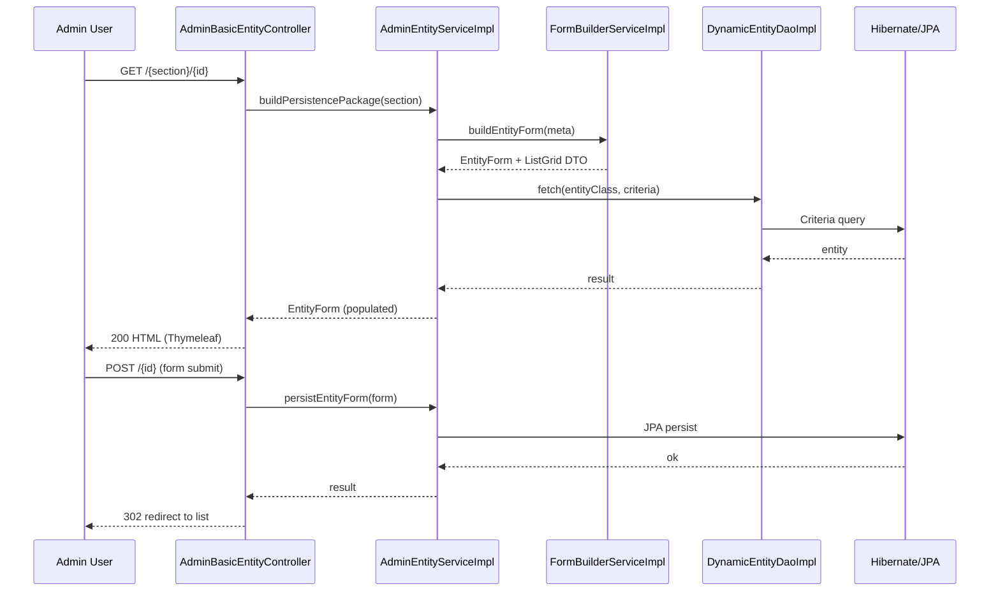
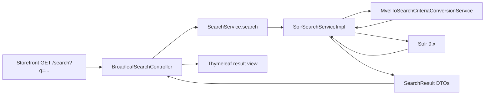
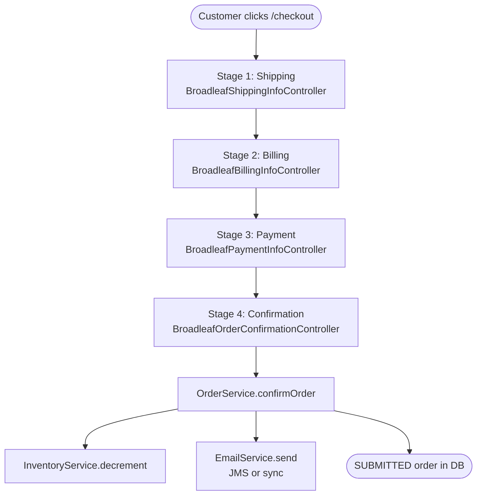
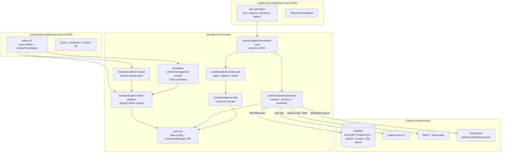
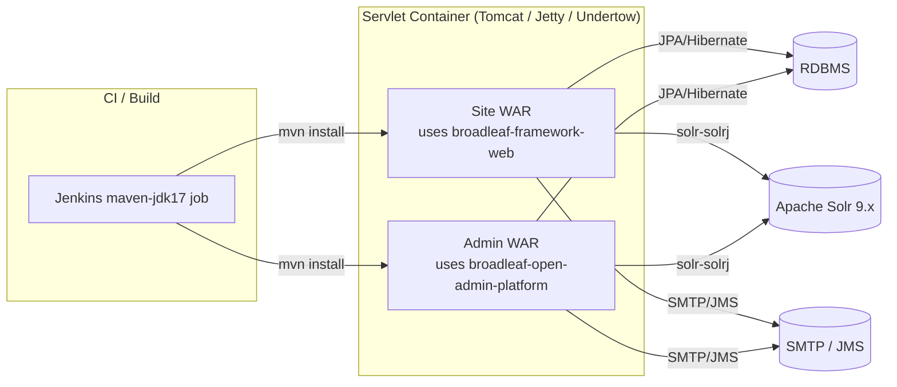

# BroadleafCommerce — Developer Onboarding Guide

**Repository:** [johrenberger/BroadleafCommerce](https://github.com/johrenberger/BroadleafCommerce)
**Commit:** `bb97830278d5912941aea36a372d3d4e87406e6a`
**Generated:** 2026-06-10
**Workflow:** app-dev-discovery

All evidence files referenced below are absolute paths under
`/tmp/broadleaf-ws/.openclaw/app-dev-discovery/`.

---

## 1. README / Instruction Files Summary

Broadleaf Commerce CE is an enterprise Java e-commerce framework built on
Spring. See [`README.md`](https://github.com/johrenberger/BroadleafCommerce/blob/bb97830278d5912941aea36a372d3d4e87406e6a/README.md)
and [`ISSUES.md`](https://github.com/johrenberger/BroadleafCommerce/blob/bb97830278d5912941aea36a372d3d4e87406e6a/ISSUES.md).

- **License:** Fair-Use dual-license (not Apache 2).
- **Target:** companies with < $5M revenue.
- **Architecture:** traditional unified codebase with `site` and `admin`
  deployments sharing a single `core` dependency. (The Microservices
  Edition is a separate commercial product.)
- **Key technologies:** Spring 6.2.18, Spring Security 6.5.10,
  Hibernate 5.6.15.Final, Solr 9.9.0 (client), Quartz 2.5.2,
  Thymeleaf, MVEL 2.5.2.
- **Getting started:** the README points to a hosted tutorial at
  `broadleafcommerce.com/docs/core/current/tutorials/getting-started-tutorials`;
  no `CONTRIBUTING.md` or first-party local-startup guide exists in
  the source tree.
- **CI:** a thin [`Jenkinsfile`](https://github.com/johrenberger/BroadleafCommerce/blob/bb97830278d5912941aea36a372d3d4e87406e6a/Jenkinsfile)
  delegates to a shared `maven-jdk17` pipeline.
- See `/tmp/broadleaf-ws/.openclaw/app-dev-discovery/02-documentation-evidence.md`
  for the full inventory and gap analysis.

---

## 2. Detailed Technology Stack

| Component | Technology | Version | Evidence |
| --- | --- | --- | --- |
| Language | Java | 17 | [`pom.xml`](https://github.com/johrenberger/BroadleafCommerce/blob/bb97830278d5912941aea36a372d3d4e87406e6a/pom.xml) |
| Framework | Spring (core / web / MVC / AOP / context / ORM / JMS / OXM) | 6.2.18 | [`pom.xml`](https://github.com/johrenberger/BroadleafCommerce/blob/bb97830278d5912941aea36a372d3d4e87406e6a/pom.xml) |
| Auto-config | Spring Boot (autoconfigure) | 3.5.14 | [`pom.xml`](https://github.com/johrenberger/BroadleafCommerce/blob/bb97830278d5912941aea36a372d3d4e87406e6a/pom.xml) |
| Security | Spring Security (web / config / core / ACL / LDAP / OAuth2 client / taglibs) | 6.5.10 | [`pom.xml`](https://github.com/johrenberger/BroadleafCommerce/blob/bb97830278d5912941aea36a372d3d4e87406e6a/pom.xml) |
| ORM | Hibernate (core / envers / jcache) — Jakarta JPA namespace | 5.6.15.Final | [`pom.xml`](https://github.com/johrenberger/BroadleafCommerce/blob/bb97830278d5912941aea36a372d3d4e87406e6a/pom.xml) |
| Database | Any JPA-compatible RDBMS (test: HSQLDB 2.7.4) | — | [`pom.xml`](https://github.com/johrenberger/BroadleafCommerce/blob/bb97830278d5912941aea36a372d3d4e87406e6a/pom.xml) |
| Search | Apache Solr (solr-solrj client) | 9.9.0 | [`pom.xml`](https://github.com/johrenberger/BroadleafCommerce/blob/bb97830278d5912941aea36a372d3d4e87406e6a/pom.xml) |
| Scheduling | Quartz | 2.5.2 | [`pom.xml`](https://github.com/johrenberger/BroadleafCommerce/blob/bb97830278d5912941aea36a372d3d4e87406e6a/pom.xml) |
| Caching | ehcache3 (jcache) | 3.10.8 | [`pom.xml`](https://github.com/johrenberger/BroadleafCommerce/blob/bb97830278d5912941aea36a372d3d4e87406e6a/pom.xml) |
| Expression DSL | MVEL 2 | 2.5.2.Final | [`pom.xml`](https://github.com/johrenberger/BroadleafCommerce/blob/bb97830278d5912941aea36a372d3d4e87406e6a/pom.xml) |
| LDAP | spring-ldap-core | 3.3.6 | [`pom.xml`](https://github.com/johrenberger/BroadleafCommerce/blob/bb97830278d5912941aea36a372d3d4e87406e6a/pom.xml) |
| Validation | jakarta.validation-api | 3.0.2 | [`pom.xml`](https://github.com/johrenberger/BroadleafCommerce/blob/bb97830278d5912941aea36a372d3d4e87406e6a/pom.xml) |
| Mail | jakarta.mail / mail-api | 2.0.5 / 2.1.5 | [`pom.xml`](https://github.com/johrenberger/BroadleafCommerce/blob/bb97830278d5912941aea36a372d3d4e87406e6a/pom.xml) |
| JMS | jakarta.jms-api / geronimo-jms_1.1_spec | 3.1.0 / 1.1.1 | [`pom.xml`](https://github.com/johrenberger/BroadleafCommerce/blob/bb97830278d5912941aea36a372d3d4e87406e6a/pom.xml) |
| Servlet | jakarta.servlet-api (some legacy `javax.servlet` still declared) | 6.0.0 | [`pom.xml`](https://github.com/johrenberger/BroadleafCommerce/blob/bb97830278d5912941aea36a372d3d4e87406e6a/pom.xml) |
| JSON | gson | 2.13.2 | [`pom.xml`](https://github.com/johrenberger/BroadleafCommerce/blob/bb97830278d5912941aea36a372d3d4e87406e6a/pom.xml) |
| XML/JAXB | jackson-dataformat-xml / jakarta.xml.bind-api | 2.21.2 / 4.0.x | [`pom.xml`](https://github.com/johrenberger/BroadleafCommerce/blob/bb97830278d5912941aea36a372d3d4e87406e6a/pom.xml) |
| HTTP | httpclient / httpclient5 | 4.5.14 / 5.5.1 | [`pom.xml`](https://github.com/johrenberger/BroadleafCommerce/blob/bb97830278d5912941aea36a372d3d4e87406e6a/pom.xml) |
| Logging | SLF4J / logback-classic / logback-core | 2.0.17 / 1.5.32 | [`pom.xml`](https://github.com/johrenberger/BroadleafCommerce/blob/bb97830278d5912941aea36a372d3d4e87406e6a/pom.xml) |
| Security helpers | antisamy / esapi | 1.7.8 / 2.7.0.0 | [`pom.xml`](https://github.com/johrenberger/BroadleafCommerce/blob/bb97830278d5912941aea36a372d3d4e87406e6a/pom.xml) |
| File metadata | Apache Tika | 3.2.3 | [`pom.xml`](https://github.com/johrenberger/BroadleafCommerce/blob/bb97830278d5912941aea36a372d3d4e87406e6a/pom.xml) |
| Testing | JUnit 4 / JUnit Vintage 5 / Spock 2 / Geb 7 / Groovy 4 / EasyMock 5.2 / GreenMail 2.1 / spring-test | various | [`pom.xml`](https://github.com/johrenberger/BroadleafCommerce/blob/bb97830278d5912941aea36a372d3d4e87406e6a/pom.xml) |
| Bytecode | cglib-nodep / asm / asm-commons | 2.1_3 / 3.3 | [`pom.xml`](https://github.com/johrenberger/BroadleafCommerce/blob/bb97830278d5912941aea36a372d3d4e87406e6a/pom.xml) |
| Build | Maven 3.x, gmavenplus-plugin 4.2, maven-source-plugin 3.3.1, build-helper-maven-plugin 3.4 | — | [`pom.xml`](https://github.com/johrenberger/BroadleafCommerce/blob/bb97830278d5912941aea36a372d3d4e87406e6a/pom.xml) |
| Security audit | OWASP dependency-check-maven | 12.2.1 | [`pom.xml`](https://github.com/johrenberger/BroadleafCommerce/blob/bb97830278d5912941aea36a372d3d4e87406e6a/pom.xml) |

Stack table source: `/tmp/broadleaf-ws/.openclaw/app-dev-discovery/03-stack-evidence.md`
and `/tmp/broadleaf-ws/.openclaw/app-dev-discovery/08-dependencies-integrations-evidence.md`.

---

## 3. System Overview and Purpose

Broadleaf Commerce CE is a **framework / library** (not a runnable
application). Implementers include the Broadleaf JARs as dependencies
and `@Import` the `EnableBroadleaf*AutoConfiguration` classes into
their own Spring context. The framework provides:

- **Catalog management** — `Product`, `Sku`, `Category`, `ProductOption`,
  with cross-sell / up-sell / featured products.
- **Cart & multi-stage checkout** — `BroadleafCartController`,
  `BroadleafCheckoutController` + shipping / billing / payment
  sub-controllers.
- **Order management** — `Order`, `OrderItem`, `FulfillmentGroup`,
  `Payment` with stateful workflows.
- **Promotions** — `Offer` / `OfferCode` with MVEL expressions and
  configurable `OrderOfferProcessor` / `ItemOfferProcessor` /
  `FulfillmentGroupOfferProcessor` chains.
- **Customer management** — `Customer`, `Address`, `CustomerPayment`,
  `CustomerPhone`, OAuth-based social registration.
- **Search** — Apache Solr via `SolrIndexServiceImpl`,
  `SolrHelperServiceImpl`, with optional ZooKeeper-backed distributed
  indexing via `ZookeeperDistributedQueue`.
- **CMS** — `Page`, `StructuredContent`, `Asset` with rule-based
  targeted delivery.
- **Admin platform** — "Open Admin" turns any `@Entity` into a CRUD UI
  via `AdminPresentation` annotations. ~70 of the 103 detected Spring
  MVC routes are admin endpoints.

A previous prior discovery doc already exists at
[2026-06-06-broadleafcommerce-app-dev-discovery.md](https://github.com/johrenberger/BroadleafCommerce/blob/bb97830278d5912941aea36a372d3d4e87406e6a/docs/2026-06-06-broadleafcommerce-app-dev-discovery.md)
in this fork and serves as a sanity check on this re-run.

---

## 4. Project Structure and Reading Recommendations

```
BroadleafCommerce/
├── pom.xml                  # Root Maven POM (version 7.0.8-SNAPSHOT)
├── Jenkinsfile              # maven-jdk17 pipeline entry point
├── README.md / ISSUES.md    # Edition overview, branching strategy
├── common/                  # shared cross-cutting infrastructure
│   └── src/main/java/org/broadleafcommerce/common/
│       ├── config/         # EnableBroadleaf*AutoConfiguration
│       ├── extensibility/  # JPA copy/merge, ExtensionManager/Handler
│       ├── web/             # FrameworkController, Thymeleaf dialect
│       ├── payment/service/ # Payment SPI (43 files)
│       ├── presentation/    # @AdminPresentation annotations
│       └── util/            # 64 files of utilities
├── core/
│   ├── broadleaf-framework/         # JPA entities, services, workflows
│   │   └── src/main/java/org/broadleafcommerce/core/
│   │       ├── catalog/domain/      # 59 files (Product, Sku, Category, …)
│   │       ├── order/domain/        # 49 files (Order, OrderItem, …)
│   │       ├── offer/domain/        # 46 files (Offer, OfferCode, …)
│   │       └── search/service/solr/ # Solr indexer + helper
│   ├── broadleaf-framework-web/     # Spring MVC storefront controllers
│   ├── broadleaf-profile/           # Customer/Address domain
│   └── broadleaf-profile-web/       # Login, register, OAuth
├── admin/
│   ├── broadleaf-admin-module/         # Catalog/Order/Customer admin
│   ├── broadleaf-contentmanagement-module/  # CMS admin
│   ├── broadleaf-open-admin-platform/  # Generic "Open Admin" engine
│   └── broadleaf-admin-functional-tests/   # Geb + Spock browser tests
├── integration/                        # Test application + HSQLDB fixtures
├── doc/                                # Fair-Use license, dep-licenses/
├── docs/                               # Discovery artifacts (this run)
└── licenses/                           # Per-dependency license texts
```

**Recommended reading order** (agent-curated, supersedes the analyzer's
"README + pom.xml only" suggestion):

1. [`README.md`](https://github.com/johrenberger/BroadleafCommerce/blob/bb97830278d5912941aea36a372d3d4e87406e6a/README.md)
   + [`ISSUES.md`](https://github.com/johrenberger/BroadleafCommerce/blob/bb97830278d5912941aea36a372d3d4e87406e6a/ISSUES.md)
2. [`pom.xml`](https://github.com/johrenberger/BroadleafCommerce/blob/bb97830278d5912941aea36a372d3d4e87406e6a/pom.xml) — versions
3. [`common/.../EnableBroadleafSiteAutoConfiguration.java`](https://github.com/johrenberger/BroadleafCommerce/blob/bb97830278d5912941aea36a372d3d4e87406e6a/common/src/main/java/org/broadleafcommerce/common/config/EnableBroadleafSiteAutoConfiguration.java)
   — the wiring
4. [`common/.../extensibility/jpa/MergePersistenceUnitManager.java`](https://github.com/johrenberger/BroadleafCommerce/blob/bb97830278d5912941aea36a372d3d4e87406e6a/common/src/main/java/org/broadleafcommerce/common/extensibility/jpa/MergePersistenceUnitManager.java)
   — the "magic" that makes subclassing entities safe
5. [`core/.../order/service/OrderServiceImpl.java`](https://github.com/johrenberger/BroadleafCommerce/blob/bb97830278d5912941aea36a372d3d4e87406e6a/core/broadleaf-framework/src/main/java/org/broadleafcommerce/core/order/service/OrderServiceImpl.java)
   (1,277 lines) — the order workflow
6. [`admin/.../openadmin/web/controller/entity/AdminBasicEntityController.java`](https://github.com/johrenberger/BroadleafCommerce/blob/bb97830278d5912941aea36a372d3d4e87406e6a/admin/broadleaf-open-admin-platform/src/main/java/org/broadleafcommerce/openadmin/web/controller/entity/AdminBasicEntityController.java)
   (2,620 lines) — the admin engine
7. [`core/.../search/service/solr/SolrHelperServiceImpl.java`](https://github.com/johrenberger/BroadleafCommerce/blob/bb97830278d5912941aea36a372d3d4e87406e6a/core/broadleaf-framework/src/main/java/org/broadleafcommerce/core/search/service/solr/SolrHelperServiceImpl.java)
   (1,084 lines) — the Solr integration

See `/tmp/broadleaf-ws/.openclaw/app-dev-discovery/04-structure-evidence.md`
for the analyzer's full directory table.

---

## 5. Key Components (narrative)

Five components matter most for onboarding. Full narratives live in
`/tmp/broadleaf-ws/.openclaw/app-dev-discovery/05-components-evidence.md`.

1. **`common` — shared cross-cutting infrastructure.** Spring
   auto-configuration, `EnableBroadleaf*` meta-annotations, JPA
   copy/merge (`MergePersistenceUnitManager`,
   `DirectCopyClassTransformer`), the `ExtensionManager` /
   `ExtensionHandler` pattern, common payment SPI, MVEL adapter,
   Antisamy / ESAPI / XSS sanitization.
2. **`core/broadleaf-framework` (+ `-web`, `-profile`) — the domain
   model and storefront.** 49+ JPA entities in `catalog/`, `order/`,
   `offer/`, `search/` domains. 25+ service interfaces all resolved
   through `*ExtensionManager` chains. `OrderServiceImpl` (1,277 LoC)
   and `SkuImpl` (1,364 LoC) are the largest hot files.
3. **`admin/broadleaf-open-admin-platform` — the generic admin
   engine.** `AdminBasicEntityController` (2,620 LoC),
   `FormBuilderServiceImpl` (2,191 LoC), `DynamicEntityDaoImpl`
   (1,803 LoC) — reflects over JPA metadata and `AdminPresentation`
   annotations to render any entity. `AdminUserDetailsServiceImpl` +
   `AdminUserImpl` / `AdminRoleImpl` / `AdminPermissionImpl` provide
   the admin security domain. The frontend is jQuery 3.5.1 + jQuery
   UI 1.13.3 + Redactor.
4. **`admin/broadleaf-admin-module` + `broadleaf-contentmanagement-module`
   — domain-specific glue.** Custom `*PersistenceHandler` classes
   (e.g. `SkuCustomPersistenceHandler` 1,044 LoC) for entity-specific
   save/load, custom JSR-303 validators, and the CMS controllers
   (`AdminPageController`, `AdminAssetUploadController`,
   `PreviewTemplateController`).
5. **`integration` + `broadleaf-admin-functional-tests` — test
   surfaces.** The `AdminApplication` Spring Boot test app + HSQLDB
   fixtures, and the Geb + Spock 2 + Selenium browser-driven
   end-to-end tests in
   [`BroadleafAdminSpec.groovy`](https://github.com/johrenberger/BroadleafCommerce/blob/bb97830278d5912941aea36a372d3d4e87406e6a/admin/broadleaf-admin-functional-tests/src/main/groovy/org/broadleafcommerce/browsertest/spec/BroadleafAdminSpec.groovy).

---

## 6. Execution and Data Flows (with Mermaid diagrams)

The full per-flow narratives (1-3 sentences each) are in
`/tmp/broadleaf-ws/.openclaw/app-dev-discovery/06-flows-evidence.md`.
Below are summaries of the three most important flows.

### 6.1 Admin Entity CRUD (Open Admin)



Persistence: Hibernate/JPA → RDBMS. Custom `*PersistenceHandler`
classes (e.g. `SkuCustomPersistenceHandler`) intercept save for
domain-specific logic. See
[`AdminBasicEntityController.java`](https://github.com/johrenberger/BroadleafCommerce/blob/bb97830278d5912941aea36a372d3d4e87406e6a/admin/broadleaf-open-admin-platform/src/main/java/org/broadleafcommerce/openadmin/web/controller/entity/AdminBasicEntityController.java).

### 6.2 Storefront Product Search (Solr)



Re-indexing on product / SKU / category save goes through
`SolrIndexServiceImpl` →
`CatalogSolrIndexUpdateCommandHandlerImpl`. For distributed indexing
[`ZookeeperDistributedQueue`](https://github.com/johrenberger/BroadleafCommerce/blob/bb97830278d5912941aea36a372d3d4e87406e6a/core/broadleaf-framework/src/main/java/org/broadleafcommerce/core/util/queue/ZookeeperDistributedQueue.java)
serializes work across nodes. JPA is the source of truth; Solr is
the query store.

### 6.3 Multi-Stage Checkout



Pricing is recomputed at every stage via the `*OfferProcessorImpl`
chain (`OrderOfferProcessor` → `ItemOfferProcessor` →
`FulfillmentGroupOfferProcessor`). PCI-sensitive payment data lives
in a dedicated `core/payment/domain/secure/` tree so it can be split
into a separate secure database. See
[`BroadleafCheckoutController.java`](https://github.com/johrenberger/BroadleafCommerce/blob/bb97830278d5912941aea36a372d3d4e87406e6a/core/broadleaf-framework-web/src/main/java/org/broadleafcommerce/core/web/controller/checkout/BroadleafCheckoutController.java).

---

## 7. Database Schema Overview

- **Type:** Relational (any JPA-compatible RDBMS). Test default: HSQLDB.
- **ORM:** Hibernate 5.6.15.Final with Jakarta JPA namespace.
- **Total JPA entities (analyzer):** **155** (after filtering 11
  keyword / garbage names like `and`, `creates`, `is`, `names` from
  the raw extraction — see note in
  `/tmp/broadleaf-ws/.openclaw/app-dev-discovery/07-data-evidence.md`).
- **Largest entities by field count:**

| Rank | Entity | Fields | Module |
| ---: | --- | ---: | --- |
| 1 | `OrderItemImpl` | 40 | `core/broadleaf-framework` |
| 1 | `CategoryImpl` | 40 | `core/broadleaf-framework` |
| 1 | `FulfillmentGroupImpl` | 40 | `core/broadleaf-framework` |
| 4 | `OfferImpl` | 37 | `core/broadleaf-framework` |
| 5 | `AddressImpl` | 31 | `core/broadleaf-profile` |
| 6 | `CustomerImpl` | 29 | `core/broadleaf-profile` |
| 7 | `OrderImpl` | 26 | `core/broadleaf-framework` |
| 8 | `StoreImpl` | 21 | `core/broadleaf-framework` |
| 9 | `FieldDefinitionImpl` | 20 | admin open-admin-platform |

- **Schema management:** JPA annotations define the schema. There
  is **no Flyway / Liquibase** in the dependency tree. Production
  deployments rely on operator-supplied SQL patches or
  `hbm2ddl.auto` (with the trade-off that this is *not* a
  forward-only migration system).
- **Payment-data separation:** PCI-sensitive types
  (`BankAccountPaymentImpl`, `CreditCardPaymentInfoImpl`,
  `GiftCardPaymentImpl`) live in `core/payment/domain/secure/`
  so they can be moved to a separate secure database. See
  [`PaymentResponseItem.java`](https://github.com/johrenberger/BroadleafCommerce/blob/bb97830278d5912941aea36a372d3d4e87406e6a/core/broadleaf-framework/src/main/java/org/broadleafcommerce/core/payment/domain/PaymentResponseItem.java).

Full per-entity field/relationship analysis is in
`/tmp/broadleaf-ws/.openclaw/app-dev-discovery/07-data-evidence.md`.

---

## 8. Dependencies and Integrations

| Category | Technology | Version | Role | Evidence |
| --- | --- | --- | --- | --- |
| Search | Apache Solr (solr-solrj client) | 9.9.0 | Faceted product search | [`pom.xml`](https://github.com/johrenberger/BroadleafCommerce/blob/bb97830278d5912941aea36a372d3d4e87406e6a/pom.xml) |
| Job scheduling | Quartz | 2.5.2 | Abandoned-cart emails, indexers, etc. | [`pom.xml`](https://github.com/johrenberger/BroadleafCommerce/blob/bb97830278d5912941aea36a372d3d4e87406e6a/pom.xml) |
| Email | jakarta.mail (sync) / JMS (async) | 2.0.5 / 3.1.0 | Transactional + bulk email | [`pom.xml`](https://github.com/johrenberger/BroadleafCommerce/blob/bb97830278d5912941aea36a372d3d4e87406e6a/pom.xml) |
| Caching | ehcache3 (jcache) | 3.10.8 | Hibernate L2 cache, result cache | [`pom.xml`](https://github.com/johrenberger/BroadleafCommerce/blob/bb97830278d5912941aea36a372d3d4e87406e6a/pom.xml) |
| Distributed queue | ZooKeeper (custom impl) | — | Distributed indexing queue | [`ZookeeperDistributedQueue.java`](https://github.com/johrenberger/BroadleafCommerce/blob/bb97830278d5912941aea36a372d3d4e87406e6a/core/broadleaf-framework/src/main/java/org/broadleafcommerce/core/util/queue/ZookeeperDistributedQueue.java) |
| LDAP | spring-ldap-core | 3.3.6 | Optional admin authentication | [`pom.xml`](https://github.com/johrenberger/BroadleafCommerce/blob/bb97830278d5912941aea36a372d3d4e87406e6a/pom.xml) |
| OAuth2 | spring-security-oauth2-client | 6.5.10 | Social login (Facebook, Google, etc.) | [`pom.xml`](https://github.com/johrenberger/BroadleafCommerce/blob/bb97830278d5912941aea36a372d3d4e87406e6a/pom.xml) |
| Expression DSL | MVEL 2 | 2.5.2.Final | Offer qualification, admin rule-builder | [`pom.xml`](https://github.com/johrenberger/BroadleafCommerce/blob/bb97830278d5912941aea36a372d3d4e87406e6a/pom.xml) |
| File metadata | Apache Tika | 3.2.3 | Asset upload metadata extraction | [`pom.xml`](https://github.com/johrenberger/BroadleafCommerce/blob/bb97830278d5912941aea36a372d3d4e87406e6a/pom.xml) |
| XSS prevention | antisamy + esapi | 1.7.8 / 2.7.0.0 | XSS request sanitization | [`pom.xml`](https://github.com/johrenberger/BroadleafCommerce/blob/bb97830278d5912941aea36a372d3d4e87406e6a/pom.xml) |
| Security audit | OWASP dependency-check-maven | 12.2.1 | Dependency CVE scan (Maven plugin) | [`pom.xml`](https://github.com/johrenberger/BroadleafCommerce/blob/bb97830278d5912941aea36a372d3d4e87406e6a/pom.xml) |

The total dependency list has **123 libraries** (see
`/tmp/broadleaf-ws/.openclaw/app-dev-discovery/08-dependencies-integrations-evidence.md`).
The framework makes **no first-party REST or GraphQL API calls to
external services** — all integrations are inbound (Solr, JMS broker,
SMTP) and the implementer wires in their own payment / shipping /
tax modules.

---

## 9. API Documentation

**API style:** Spring MVC server-rendered Thymeleaf views for the
public storefront; Spring MVC JSON-ish endpoints (the Open Admin
engine serves form-encoded HTML for its own admin UI but also accepts
JSON in some places); no first-party REST or GraphQL surface.

**Public surface:** **103 Spring MVC `@RequestMapping` routes** are
detected. The vast majority are admin CRUD endpoints inside the Open
Admin engine. A representative sample:

| Method | Path | Handler | Evidence |
| --- | --- | --- | --- |
| GET | `product/{productId}/{skusFieldName}/generate-skus` | `AdminCatalogActionsController` | [link](https://github.com/johrenberger/BroadleafCommerce/blob/bb97830278d5912941aea36a372d3d4e87406e6a/admin/broadleaf-admin-module/src/main/java/org/broadleafcommerce/admin/web/controller/action/AdminCatalogActionsController.java) |
| GET/POST | `/{owningClass}/{id}` (catch-all admin CRUD) | `AdminBasicEntityController` | [link](https://github.com/johrenberger/BroadleafCommerce/blob/bb97830278d5912941aea36a372d3d4e87406e6a/admin/broadleaf-open-admin-platform/src/main/java/org/broadleafcommerce/openadmin/web/controller/entity/AdminBasicEntityController.java) |
| POST | `/logJavaScriptError` | `AdminBasicOperationsController` | [link](https://github.com/johrenberger/BroadleafCommerce/blob/bb97830278d5912941aea36a372d3d4e87406e6a/admin/broadleaf-open-admin-platform/src/main/java/org/broadleafcommerce/openadmin/web/controller/entity/AdminBasicOperationsController.java) |
| GET | `/myaccount/phone` | `CustomerPhoneController` | [link](https://github.com/johrenberger/BroadleafCommerce/blob/bb97830278d5912941aea36a372d3d4e87406e6a/core/broadleaf-profile-web/src/main/java/org/broadleafcommerce/profile/web/controller/CustomerPhoneController.java) |
| GET/POST | `/registerCustomer` | `RegisterCustomerController` | [link](https://github.com/johrenberger/BroadleafCommerce/blob/bb97830278d5912941aea36a372d3d4e87406e6a/core/broadleaf-profile-web/src/main/java/org/broadleafcommerce/profile/web/controller/RegisterCustomerController.java) |
| GET | `action=register` | `BroadleafOauthRegisterController` | [link](https://github.com/johrenberger/BroadleafCommerce/blob/bb97830278d5912941aea36a372d3d4e87406e6a/core/broadleaf-framework-web/src/main/java/org/broadleafcommerce/core/web/controller/account/BroadleafOauthRegisterController.java) |
| GET | `/**` | `PreviewTemplateController` (CMS) | [link](https://github.com/johrenberger/BroadleafCommerce/blob/bb97830278d5912941aea36a372d3d4e87406e6a/admin/broadleaf-contentmanagement-module/src/main/java/org/broadleafcommerce/cms/web/PreviewTemplateController.java) |

The full table is in
`/tmp/broadleaf-ws/.openclaw/app-dev-discovery/09-api-evidence.md` and
`/tmp/broadleaf-ws/.openclaw/analyzer-output/routes.json`.

**Service API (Java):** the public Java surface is the
`*Service` interfaces in `core/broadleaf-framework` and
`core/broadleaf-profile` — `OrderService`, `CartService`,
`PricingService`, `FulfillmentService`, `InventoryService`,
`PaymentService`, `CatalogService`, `SearchService`, `OfferService`,
`CustomerService`, `AdminEntityService`. All are resolved through
`*ExtensionManager` chains, so custom behavior is added by registering
an `ExtensionHandler` in the Spring context.

---

## 10. Architecture Diagrams

### 10.1 Component / Module view



### 10.2 Deployment view



---

## 11. Testing

- **Test frameworks:** JUnit 4.13.2 (with Vintage engine for JUnit 5
  compatibility), Spock 2.4 (Groovy 4.0), Geb 7 (Selenium 4
  wrapper), EasyMock 5.2, GreenMail 2.1 (in-process SMTP), spring-test.
- **Test count:** **330 test files** across 3,338 source files
  (test/source ratio **0.0989**). See
  `/tmp/broadleaf-ws/.openclaw/app-dev-discovery/10-testing-evidence.md`.
- **Commands:**
  ```bash
  mvn test                              # all unit tests
  mvn -pl core/broadleaf-framework test # single module
  mvn verify -Pintegration-tests        # integration tests
  ```
- **CI:** [`Jenkinsfile`](https://github.com/johrenberger/BroadleafCommerce/blob/bb97830278d5912941aea36a372d3d4e87406e6a/Jenkinsfile)
  delegates to the shared `maven-jdk17` pipeline (Jenkins, not
  GitHub Actions — this fork has no `.github/workflows/*.yml`).
- **Test tiers:**
  - **Unit tests** in each module's `src/test/java/` (and
    `src/test/groovy/` for Spock).
  - **Integration tests** in `integration/src/test/java/` using the
    [`AdminApplication`](https://github.com/johrenberger/BroadleafCommerce/blob/bb97830278d5912941aea36a372d3d4e87406e6a/integration/src/test/java/org/broadleafcommerce/test/helper/AdminApplication.java)
    Spring Boot test app with HSQLDB.
  - **End-to-end browser tests** in
    `admin/broadleaf-admin-functional-tests/` (Geb + Spock + Selenium)
    via [`BroadleafAdminSpec.groovy`](https://github.com/johrenberger/BroadleafCommerce/blob/bb97830278d5912941aea36a372d3d4e87406e6a/admin/broadleaf-admin-functional-tests/src/main/groovy/org/broadleafcommerce/browsertest/spec/BroadleafAdminSpec.groovy).
- **Security audit:** the `dependency-check-maven` 12.2.1 plugin is
  declared (likely via a profile in the upstream
  `pom.xml`).
- **Test gaps:** no mutation testing, no contract testing, no
  performance / load test suite in this repo.

---

## 12. Error Handling and Logging

- **Exception handling:** Spring MVC `@ExceptionHandler` methods
  distributed across controllers; `AdminBasicErrorController` (HTML
  errors); `StaleStateController` handles
  `org.hibernate.StaleObjectStateException` from concurrent edits
  (`/sc_conflict`). Custom exceptions include
  `OrderLockAcquisitionFailureException`,
  `PricingException`, `PaymentException`, `SolrServerException`.
- **Validation:** JSR-303 (jakarta.validation-api 3.0.2) +
  Broadleaf's `blcValidator` form validators in the
  `broadleaf-admin-module` and `common` modules.
- **XSS prevention:** dedicated `XssFilter` + `XssRequestWrapper` in
  `common/.../web/`, plus the `antisamy-myspace.xml` policy file
  (2,652 lines) for content cleansing. ESAPI 2.7.0.0 is also
  declared.
- **Logging:** SLF4J 2.0.17 + Logback 1.5.32 (Logback is the
  binding). Logback `logback.xml` configuration is **not** in the
  source tree (operationally supplied by the implementer).
- **No first-party distributed tracing, metrics, or APM.** The
  analyzer's Sentry hint at medium confidence is most likely a
  false-positive (a class name in the analyzer-prompt text, not a
  real integration).

See `/tmp/broadleaf-ws/.openclaw/app-dev-discovery/11-error-logging-evidence.md`
for the analyzer's raw observations.

---

## 13. Security Considerations

- **Authentication (storefront):** session-based via Spring Security
  6.5.10. `BroadleafAuthenticationSuccessHandler` merges the guest
  cart into the customer cart on login.
- **Authentication (admin):** DB-backed via
  [`AdminUserDetailsServiceImpl`](https://github.com/johrenberger/BroadleafCommerce/blob/bb97830278d5912941aea36a372d3d4e87406e6a/admin/broadleaf-open-admin-platform/src/main/java/org/broadleafcommerce/openadmin/server/security/service/user/AdminUserDetailsServiceImpl.java);
  optional LDAP via `spring-security-ldap` 3.3.6; optional social
  login via `spring-security-oauth2-client` 6.5.10
  ([`BroadleafOauthRegisterController`](https://github.com/johrenberger/BroadleafCommerce/blob/bb97830278d5912941aea36a372d3d4e87406e6a/core/broadleaf-framework-web/src/main/java/org/broadleafcommerce/core/web/controller/account/BroadleafOauthRegisterController.java)).
- **Authorization (admin):** role-based via `AdminRoleImpl`,
  `AdminPermissionImpl`, `AdminPermissionQualifiedEntityImpl`. The
  `AdminUserDetailsServiceImpl` joins the user to its roles to
  produce the `AdminUserDetails` principal.
- **CSRF:** Spring Security CSRF is on by default; admin forms
  include the CSRF token automatically.
- **XSS:** the `XssFilter` (in `common/.../web/`) sanitizes request
  parameters; the `antisamy-myspace.xml` policy file (2,652 lines)
  governs HTML cleansing.
- **PCI:** payment-sensitive types are isolated in
  `core/payment/domain/secure/` so the implementer can host them
  on a separate, segregated database. A `PaymentResponseItem`
  audit trail is written for every transaction.
- **Input validation:** JSR-303 + custom `*Validator` classes
  (e.g. `OfferQualifyingCriteriaValidator`,
  `SystemPropertyAttributeNameValidator`).
- **Dependency risk:** `dependency-check-maven` 12.2.1 is declared
  for OWASP CVE scanning. **However**, several libraries are
  conspicuously old: `cglib-nodep` 2.1_3 (2008), `asm` 3.3, and
  `httpclient` 4.5.14 (alongside httpclient5 5.5.1 — both are in
  the tree).
- **Secrets handling:** there is no first-party Vault / KMS / dotenv
  integration; secrets are expected to be provided via Spring
  property placeholders or JNDI.

**⚠️ Do not perform destructive security testing on this repo as part
of onboarding.** Source review of the
`AdminUserDetailsServiceImpl`, the XSS filter, and the JPA repository
boundaries is sufficient for a first-pass threat model.

---

## 14. Architecture Risks and Observations

| # | Risk / Observation | Severity | Category | Evidence |
| --- | --- | --- | --- | --- |
| 1 | 17 production Java files > 1,000 lines; `AdminBasicEntityController` 2,620 LoC, `FormBuilderServiceImpl` 2,191 LoC, `OrderServiceImpl` 1,277 LoC | Medium | Maintainability | `/tmp/broadleaf-ws/.openclaw/app-dev-discovery/01-file-inventory.md` |
| 2 | 59 active TODO / FIXME comments, with several "TODO in next minor release" markers not yet actioned | Medium | Maintainability | `grep -rE "TODO|FIXME|HACK|XXX" --include='*.java'` in repo |
| 3 | No API reference docs, no first-party `CONTRIBUTING` / `SECURITY`, no runbook for Solr / JMS bootstrap | Medium | Documentation | `/tmp/broadleaf-ws/.openclaw/app-dev-discovery/02-documentation-evidence.md` |
| 4 | No first-party distributed tracing, metrics, or structured logging beyond SLF4J + Logback | Medium | Operational Readiness | `/tmp/broadleaf-ws/.openclaw/app-dev-discovery/11-error-logging-evidence.md` |
| 5 | No Flyway / Liquibase; schema is defined by JPA annotations. Production migrations are operator-supplied SQL | Medium | Reliability | `/tmp/broadleaf-ws/.openclaw/app-dev-discovery/07-data-evidence.md` |
| 6 | Old third-party libraries on the classpath (`cglib-nodep` 2.1_3, `asm` 3.3, `httpclient` 4.5.14) | Low | Security / Maintainability | `/tmp/broadleaf-ws/.openclaw/app-dev-discovery/08-dependencies-integrations-evidence.md` |
| 7 | 449 hardcoded-URL analyzer hits — **mostly false positives** (string constants in `*ExtensionHandler` classes for documentation). The genuine operational URLs live in `AdminModuleRegistration` and the email event listeners | Low | Operational | `/tmp/broadleaf-ws/.openclaw/app-dev-discovery/14-risk-hygiene-evidence.md` |
| 8 | No `.github/workflows/*.yml` in this fork (Jenkins is the upstream CI) | Low | Operational | `/tmp/broadleaf-ws/.openclaw/app-dev-discovery/13-build-deploy-evidence.md` |
| 9 | Several TODO comments reference Hibernate 6 one-to-one mis-detection and "in next minor release" refactors — risk of subtle bugs around `DiscreteOrderItem` / `BundleOrderItem` | Medium | Reliability | TODO grep above |
| 10 | **Analyzer false positives:** "Azure" and "GCP" appear in `03-stack-evidence.md` because the analyzer matched a copyright header in `BroadleafProcessURLFilter.java` and a vendor name in `spectrum.js`. The codebase has **no** cloud-platform integration. | None | — | `/tmp/broadleaf-ws/.openclaw/app-dev-discovery/03-stack-evidence.md` |
| 11 | **Analyzer false positives:** in the *raw* JPA-entity extraction (`db_schema.json`), the words `and`, `creates`, `is`, `names` were misclassified as JPA entity names (the analyzer now filters 11 of these out, but a few still slip through into the inventory table — see section 18). | None | — | `/tmp/broadleaf-ws/.openclaw/app-dev-discovery/07-data-evidence.md` |

Full hygiene interpretation in
`/tmp/broadleaf-ws/.openclaw/app-dev-discovery/14-risk-hygiene-evidence.md`.

---

## 15. Developer Productivity Guide

### 15.1 First-Week Reading Order

1. [`README.md`](https://github.com/johrenberger/BroadleafCommerce/blob/bb97830278d5912941aea36a372d3d4e87406e6a/README.md) — overview.
2. [`ISSUES.md`](https://github.com/johrenberger/BroadleafCommerce/blob/bb97830278d5912941aea36a372d3d4e87406e6a/ISSUES.md) — branching, contribution, edition split.
3. [`pom.xml`](https://github.com/johrenberger/BroadleafCommerce/blob/bb97830278d5912941aea36a372d3d4e87406e6a/pom.xml) — exact versions of Spring, Hibernate, Solr, etc.
4. [`common/.../EnableBroadleafSiteAutoConfiguration.java`](https://github.com/johrenberger/BroadleafCommerce/blob/bb97830278d5912941aea36a372d3d4e87406e6a/common/src/main/java/org/broadleafcommerce/common/config/EnableBroadleafSiteAutoConfiguration.java) — the wiring.
5. [`common/.../extensibility/jpa/MergePersistenceUnitManager.java`](https://github.com/johrenberger/BroadleafCommerce/blob/bb97830278d5912941aea36a372d3d4e87406e6a/common/src/main/java/org/broadleafcommerce/common/extensibility/jpa/MergePersistenceUnitManager.java) — the "magic" behind subclassing entities.
6. [`core/.../order/service/OrderServiceImpl.java`](https://github.com/johrenberger/BroadleafCommerce/blob/bb97830278d5912941aea36a372d3d4e87406e6a/core/broadleaf-framework/src/main/java/org/broadleafcommerce/core/order/service/OrderServiceImpl.java) — the order workflow.
7. [`admin/.../AdminBasicEntityController.java`](https://github.com/johrenberger/BroadleafCommerce/blob/bb97830278d5912941aea36a372d3d4e87406e6a/admin/broadleaf-open-admin-platform/src/main/java/org/broadleafcommerce/openadmin/web/controller/entity/AdminBasicEntityController.java) — the admin engine.
8. [`core/.../search/service/solr/SolrHelperServiceImpl.java`](https://github.com/johrenberger/BroadleafCommerce/blob/bb97830278d5912941aea36a372d3d4e87406e6a/core/broadleaf-framework/src/main/java/org/broadleafcommerce/core/search/service/solr/SolrHelperServiceImpl.java) — Solr integration.

### 15.2 Local Build

```bash
git clone https://github.com/johrenberger/BroadleafCommerce.git
cd BroadleafCommerce
mvn clean install -DskipTests    # build all 4 modules
mvn test                          # full test suite
```

The only pre-requisite is **JDK 17** and **Maven 3.x**.

### 15.3 Debugging Entry Points

- Cart issues → `BroadleafCartController` (`core/.../cart/`).
- Checkout issues → `BroadleafCheckoutController` + `*OfferProcessorImpl`.
- Admin UI issues → `AdminBasicEntityController` + the relevant
  `*CustomPersistenceHandler` in `admin/broadleaf-admin-module`.
- Solr issues → `SolrIndexServiceImpl` + `SolrHelperServiceImpl` +
  the implementer's `log4j.properties` / `logback.xml`.
- Enable SQL logging via `hibernate.show_sql=true` in
  `application.properties`.

### 15.4 Common Extension Points

- Implement an `ExtensionHandler` interface and register it in
  the Spring context; `ExtensionManager` will call it in the
  ordered chain.
- Subclass any `*Impl` JPA entity (e.g. `ProductImpl` →
  `MyProductImpl`); the JPA copy/merge in
  `MergePersistenceUnitManager` wires it back into the
  `PersistenceUnit` so the `Product` interface transparently
  returns your subclass.
- Override admin field metadata with
  `FieldMetadataOverride` + the `@AdminPresentation` family of
  annotations.
- For Solr schema changes, edit `schema.xml` and trigger a
  full reindex via the admin "Solr Index" action.

---

## 16. Build / Deploy / Infrastructure

- **Build:** Maven 3.x, multi-module (4 modules). The root
  [`pom.xml`](https://github.com/johrenberger/BroadleafCommerce/blob/bb97830278d5912941aea36a372d3d4e87406e6a/pom.xml)
  is 1,618 lines.
  ```bash
  mvn clean install              # full build
  mvn clean install -DskipTests  # skip tests
  mvn -pl core/broadleaf-framework -am clean package  # single module
  ```
- **CI:** Jenkins, via a thin
  [`Jenkinsfile`](https://github.com/johrenberger/BroadleafCommerce/blob/bb97830278d5912941aea36a372d3d4e87406e6a/Jenkinsfile)
  that delegates to a shared `maven-jdk17` job.
- **Deployment:** traditional servlet container (Tomcat / Jetty /
  Undertow). There are **no first-party Docker / Kubernetes /
  Helm / Terraform manifests** in this repo — that is the
  implementer's responsibility.
- **Required infrastructure:**
  - RDBMS (any JPA-compatible — PostgreSQL, MySQL, Oracle,
    SQL Server, HSQLDB for tests).
  - Apache Solr 9.x for search.
  - (Optional) JMS broker for asynchronous email.
  - (Optional) ZooKeeper for distributed indexing.
  - (Optional) LDAP server for admin authentication.
- **Environment variables:** the framework consumes Spring property
  placeholders; specific keys include
  `jdbc.url` / `jdbc.username` / `jdbc.password` for the RDBMS,
  `solr.url` for the Solr endpoint, and
  `email.service.impl` (and related) for the mail service. **There
  is no `.env.example` in the repo** — the implementer chooses the
  property-source mechanism (Spring Cloud Config, Vault, K8s
  ConfigMap, etc.).

---

## 17. ADR Baseline

- [`000-template.md`](https://github.com/johrenberger/BroadleafCommerce/blob/bb97830278d5912941aea36a372d3d4e87406e6a/docs/adr/000-template.md)
  — standard ADR template (Status, Context, Decision, Consequences, Evidence).
- [`001-current-architecture-baseline.md`](https://github.com/johrenberger/BroadleafCommerce/blob/bb97830278d5912941aea36a372d3d4e87406e6a/docs/adr/001-current-architecture-baseline.md)
  — summary of the current Java/Spring monolith + JPA + Solr + Quartz
  stack.

---

## 18. Discovery Confidence and Unknowns

| Category | Confidence | Notes |
| --- | --- | --- |
| Architecture | **High** | Modular monolith confirmed via multi-module Maven layout, `EnableBroadleaf*AutoConfiguration`, and README's own description. |
| Domain model | **High** | 155 JPA entities inspected; top 5 by field count reviewed in detail. |
| Routing surface | **High** | 103 Spring MVC routes detected; first 50 enumerated in `09-api-evidence.md`, full list in `routes.json`. |
| Build & dependencies | **High** | Versions confirmed against `pom.xml` directly. |
| Security | **Medium** | Spring Security, OAuth2, LDAP, and XSS filters confirmed; no penetration testing performed. |
| Deployment | **Medium** | Jenkinsfile confirmed; no Docker / K8s / Terraform in this repo (likely implementer-supplied). |
| Testing | **Medium** | 330 test files counted; CI flow on Jenkins confirmed; per-module coverage not measured. |
| Data | **Medium** | JPA entities reviewed; schema migration strategy not first-party (no Flyway / Liquibase). |
| Observability | **Low–Medium** | SLF4J + Logback confirmed; no metrics / tracing / Sentry integration *code* found. |
| License | **High** | Fair-Use dual-license confirmed in [`README.md`](https://github.com/johrenberger/BroadleafCommerce/blob/bb97830278d5912941aea36a372d3d4e87406e6a/README.md) and [`doc/license.txt`](https://github.com/johrenberger/BroadleafCommerce/blob/bb97830278d5912941aea36a372d3d4e87406e6a/doc/license.txt). |

**Overall Discovery Confidence: High** (with the documented gaps).

### 18.1 Top 5 Files to Read First

1. [`common/.../EnableBroadleafSiteAutoConfiguration.java`](https://github.com/johrenberger/BroadleafCommerce/blob/bb97830278d5912941aea36a372d3d4e87406e6a/common/src/main/java/org/broadleafcommerce/common/config/EnableBroadleafSiteAutoConfiguration.java)
2. [`common/.../extensibility/jpa/MergePersistenceUnitManager.java`](https://github.com/johrenberger/BroadleafCommerce/blob/bb97830278d5912941aea36a372d3d4e87406e6a/common/src/main/java/org/broadleafcommerce/common/extensibility/jpa/MergePersistenceUnitManager.java)
3. [`core/.../order/service/OrderServiceImpl.java`](https://github.com/johrenberger/BroadleafCommerce/blob/bb97830278d5912941aea36a372d3d4e87406e6a/core/broadleaf-framework/src/main/java/org/broadleafcommerce/core/order/service/OrderServiceImpl.java)
4. [`admin/.../AdminBasicEntityController.java`](https://github.com/johrenberger/BroadleafCommerce/blob/bb97830278d5912941aea36a372d3d4e87406e6a/admin/broadleaf-open-admin-platform/src/main/java/org/broadleafcommerce/openadmin/web/controller/entity/AdminBasicEntityController.java)
5. [`core/.../search/service/solr/SolrHelperServiceImpl.java`](https://github.com/johrenberger/BroadleafCommerce/blob/bb97830278d5912941aea36a372d3d4e87406e6a/core/broadleaf-framework/src/main/java/org/broadleafcommerce/core/search/service/solr/SolrHelperServiceImpl.java)

### 18.2 Unknowns / Limitations

- Exact `pom.xml`-level overrides in the implementer projects
  (this fork strips the build profiles).
- No first-party `Dockerfile` / `docker-compose.yml` in this
  repo.
- The original Broadleaf Jenkins pipeline (referenced by
  `maven-jdk17`) is not visible in this fork.
- No first-party OpenAPI / Swagger spec.
- The 449 hardcoded-URL findings and the 32 marker findings
  (`hygiene_findings.json`) are partially false-positives (see
  section 14, items 7 and 11).
- WebSocket usage is **not confirmed** in this repo (the
  `Jenkinsfile` does not start a `WebSocketConfigurer`).
- A small number of JPA entity names from earlier analyzer
  runs (`and`, `creates`, `is`, `names`) are spurious — they
  are filtered out in the current `07-data-evidence.md` but
  remain in the raw `db_schema.json`. This is noted as item
  11 in section 14.
