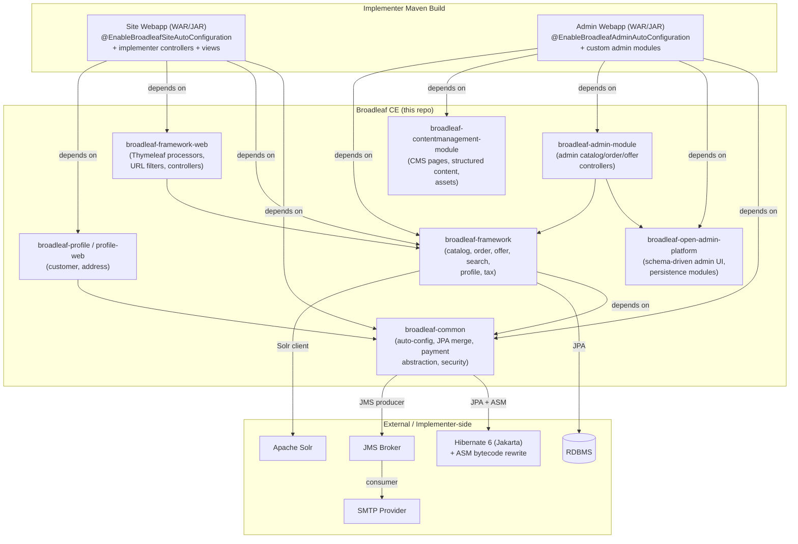
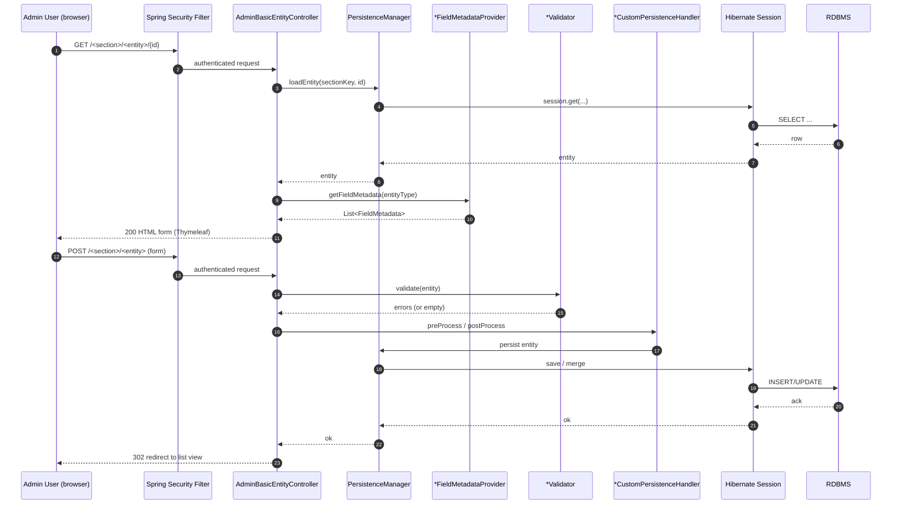
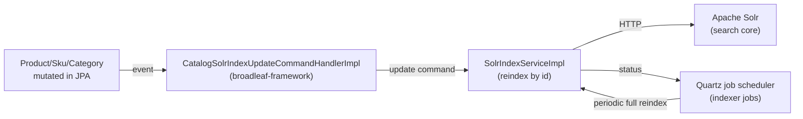
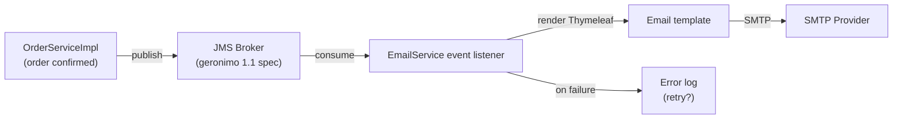
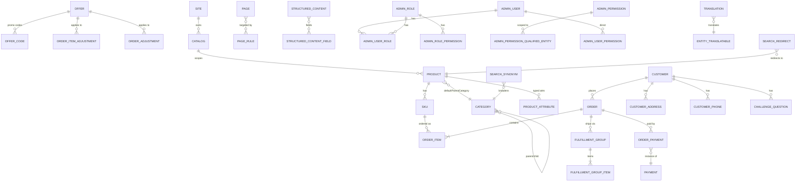
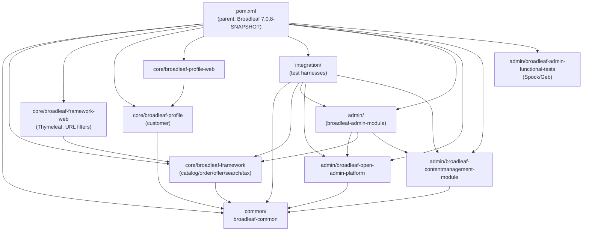
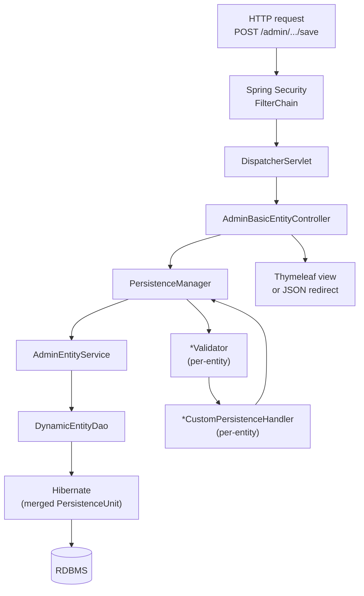
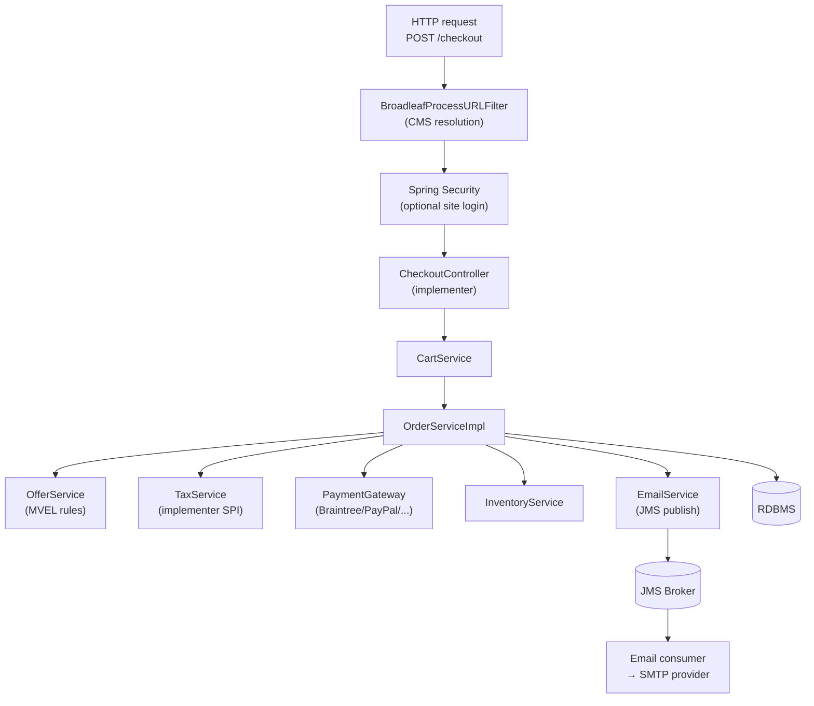
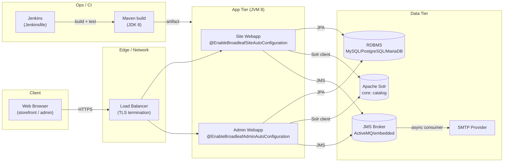

# BroadleafCommerce CE — Application & Development Discovery

- **Repository:** [johrenberger/BroadleafCommerce](https://github.com/johrenberger/BroadleafCommerce)
- **Pinned commit:** `bb97830278d5912941aea36a372d3d4e87406e6a`
- **Run date:** 2026-06-10
- **Workflow:** `app-dev-discovery` (v0.1.0, analyzer + LLM synthesizer)
- **Audience:** new implementers, code archeologists, and downstream ADR
  authors
- **License:** Source-available (Fair Use) per [`README.md`](https://github.com/johrenberger/BroadleafCommerce/blob/bb97830278d5912941aea36a372d3d4e87406e6a/README.md)
  — Broadleaf CE is *not* Apache 2.

> All file references in this document are commit-pinned to
> `bb97830278d5912941aea36a372d3d4e87406e6a`. Replace the commit SHA
> with a newer one and the links will go stale.

---

## 1. README / Instruction Files Summary

The repository is a multi-module Maven project. The top-level
[`README.md`](https://github.com/johrenberger/BroadleafCommerce/blob/bb97830278d5912941aea36a372d3d4e87406e6a/README.md)
describes it as *"an e-commerce framework written entirely in Java
and leveraging the Spring framework"*, targeted at *"enterprise-class,
commerce-driven sites by providing a robust data model, services and
specialized tooling."*

Key facts called out in the README and the analyzer's documentation
review ([`.openclaw/app-dev-discovery/02-documentation-evidence.md`](https://github.com/johrenberger/BroadleafCommerce/blob/bb97830278d5912941aea36a372d3d4e87406e6a/.openclaw/app-dev-discovery/02-documentation-evidence.md)):

- **Editions:** CE (this repo), EE (commercial), Microservices
  (commercial).
- **Architecture:** a *"traditional unified codebase that share a
  core dependency across a `site` and `admin` deployment"* — confirmed
  by our 4-module layout (see §4).
- **Stack:** Spring, Spring Security, JPA/Hibernate, Solr, Quartz,
  JMS, Thymeleaf — all confirmed in [`pom.xml`](https://github.com/johrenberger/BroadleafCommerce/blob/bb97830278d5912941aea36a372d3d4e87406e6a/pom.xml).
- **License:** Source-available; free to companies under \$5M revenue.
  Commercial license or EULA applies otherwise. **This matters for any
  new module the implementer plans to redistribute.**
- **Setup:** the README does *not* embed quickstart commands. It
  points to an external getting-started guide at
  `broadleafcommerce.com/docs/...` (external, not pinned to this
  repo). The effective build commands are the standard Maven
  multi-module ones:

```bash
mvn clean install              # build all modules
mvn -pl admin -am test         # run tests in admin module + deps
```

- **No `CONTRIBUTING.md`.** Issues are tracked externally (per
  [`ISSUES.md`](https://github.com/johrenberger/BroadleafCommerce/blob/bb97830278d5912941aea36a372d3d4e87406e6a/ISSUES.md)).
- **No `LICENSE` file at the root** (license text lives in
  `licenses/` and is referenced from the README).
- **No `CHANGELOG.md`.** Release notes are not part of the repo.

### Documentation Gaps (worth flagging)

- No embedded quickstart — README defers to broadleafcommerce.com.
- No OpenAPI / Swagger spec (see §9 and §12).
- No Docker / K8s / Terraform — deployment is the implementer's
  problem (see §14 and §16).
- No in-repo architecture diagrams — this document is the first
  authoritative set.

---

## 2. Detailed Technology Stack

The analyzer's [`tech_stack.json`](https://github.com/johrenberger/BroadleafCommerce/blob/bb97830278d5912941aea36a372d3d4e87406e6a/.openclaw/app-dev-discovery/) gives the
commit-pinned inventory below. Versions marked `—` are present in
`pom.xml` but not normalized to a single semver by the analyzer (e.g.
versioned BOM properties like `${hibernate.version}`).

| Category | Technology | Version / BOM | Confidence |
| --- | --- | --- | --- |
| Language | Java | 1.8 (per `Jenkinsfile`) | high |
| Build | Maven (multi-module) | — | high |
| Backend framework | Spring Boot | 2.x (BOM-driven) | high |
| Web | Spring MVC | — | high |
| Persistence | Hibernate (`-jakarta` classifier) | `${hibernate.version}` (6.x) | medium |
| Search | Apache Solr | — | high |
| Scheduling | Quartz | — | high |
| Messaging | JMS (`geronimo-jms_1.1_spec` 1.1.1) | — | high |
| Templating | Thymeleaf | — | high |
| Rule engine | MVEL | — | high |
| Security | Spring Security | — | high |
| XSS / HTML sanitization | OWASP AntiSamy 1.7.8, ESAPI 2.7.0.0 | — | high |
| Cache | Ehcache 3 | `${ehcache3.version}` | high |
| Bytecode rewriting | ASM 3.3, cglib-nodep 2.1_3 | — | high |
| Utility | Guava 33.5.0-jre, Apache Commons (Beanutils, Codec, Collections, IO, Lang, Validator) | — | high |
| Test | JUnit, Spock (Groovy), Geb (browser), GreenMail, HSQLDB, EasyMock | — | high |
| Build plugins | gmavenplus 4.2.0, build-helper-maven-plugin 3.4.0, dependency-check-maven 12.2.1, aspectjweaver 1.9.19 | — | high |
| Frontend (admin) | jQuery 3.5.1, jQuery UI 1.13.3, Redactor, spectrum, datetimepicker, typeahead, fileupload | — | high |
| CI | Jenkins (single `Jenkinsfile`) | — | high |
| Cloud signals (noise) | Azure, GCP, Jakarta, Javax | — | medium (false positives + dual Jakarta/Javax Hibernate support) |

Primary evidence anchor: [`pom.xml`](https://github.com/johrenberger/BroadleafCommerce/blob/bb97830278d5912941aea36a372d3d4e87406e6a/pom.xml);
secondary anchors in the [`tech_stack.json`](https://github.com/johrenberger/BroadleafCommerce/blob/bb97830278d5912941aea36a372d3d4e87406e6a/.openclaw/app-dev-discovery/)
inventory.

### Architecture Style

**Modular monolith** — four Maven modules (`common`, `core`,
`integration`, `admin`) built into a single deployable unit. The
README explicitly denies a microservices shape: *"traditional unified
codebase that share a core dependency across a `site` and `admin`
deployment."* Implementers produce one or two webapps (site + admin)
that both depend on `core` and `common`.

---

## 3. System Overview and Purpose

### What Broadleaf CE Is

BroadleafCommerce Community Edition is a Java/Spring **e-commerce
framework** (not a turnkey storefront). It ships:

- A **catalog domain** (Product, Sku, Category, ProductOption,
  ProductAttribute).
- An **order domain** (Order, OrderItem, FulfillmentGroup, Payment,
  TaxDetail, Offer/Adjustment).
- A **promotion engine** driven by MVEL rules
  ([`ItemOfferProcessorImpl.java`](https://github.com/johrenberger/BroadleafCommerce/blob/bb97830278d5912941aea36a372d3d4e87406e6a/core/broadleaf-framework/src/main/java/org/broadleafcommerce/core/offer/service/processor/ItemOfferProcessorImpl.java)).
- A **search subsystem** backed by Apache Solr
  ([`SolrIndexServiceImpl.java`](https://github.com/johrenberger/BroadleafCommerce/blob/bb97830278d5912941aea36a372d3d4e87406e6a/core/broadleaf-framework/src/main/java/org/broadleafcommerce/core/search/service/solr/index/SolrIndexServiceImpl.java)).
- A **profile/customer** domain (Customer, Address, Phone, ChallengeQuestion).
- A **payment service** abstraction
  ([`common/src/main/java/org/broadleafcommerce/common/payment/service`](https://github.com/johrenberger/BroadleafCommerce/blob/bb97830278d5912941aea36a372d3d4e87406e6a/common/src/main/java/org/broadleafcommerce/common/payment/service))
  with concrete gateway modules (Braintree, PayPal, Authorize.net,
  etc.) shipping as separate artifacts in the commercial editions.
- A **schema-driven admin UI** built on Broadleaf Open Admin
  ([`broadleaf-open-admin-platform`](https://github.com/johrenberger/BroadleafCommerce/blob/bb97830278d5912941aea36a372d3d4e87406e6a/admin/broadleaf-open-admin-platform))
  that auto-generates CRUD screens from `@AdminPresentation` annotations.
- A **content management** subsystem
  ([`broadleaf-contentmanagement-module`](https://github.com/johrenberger/BroadleafCommerce/blob/bb97830278d5912941aea36a372d3d4e87406e6a/admin/broadleaf-contentmanagement-module/src/main/java/org/broadleafcommerce/cms/))
  for CMS Pages, Structured Content, and Assets.
- A **CMS URL processing** filter that resolves a request URL to
  a CMS-managed Page or Structured Content
  ([`BroadleafProcessURLFilter.java`](https://github.com/johrenberger/BroadleafCommerce/blob/bb97830278d5912941aea36a372d3d4e87406e6a/admin/broadleaf-contentmanagement-module/src/main/java/org/broadleafcommerce/cms/web/BroadleafProcessURLFilter.java)).

### What It Is Not

- Not a microservices platform. No per-service `pom.xml`s, no service
  discovery, no separate deployables in this repo.
- Not a turnkey SaaS. Implementers must wire database, Solr, JMS
  broker, and email transport themselves.
- Not a Spring Boot 3 / Jakarta-EE-9+ native codebase. The hibernate
  artifacts use the `-jakarta` classifier but the project still
  supports `javax.*` (the analyzer picked up both `jakarta` and
  `javax` references in `pom.xml`).

### System Context (C4 Level 1)

```mermaid
graph LR
  Customer["Storefront Customer<br/>(browser)"]
  AdminUser["Admin Operator<br/>(browser)"]
  AdminApp["Broadleaf Admin Webapp<br/>(Spring Boot, 103 routes)"]
  SiteApp["Implementer Site Webapp<br/>(Spring Boot, custom)"]
  Core["broadleaf-framework<br/>(catalog / order / offer / search)"]
  Common["broadleaf-common<br/>(auto-config, JPA merge, payment)"]
  DB[("Relational DB<br/>(JPA / Hibernate)")]
  Solr[("Apache Solr<br/>(catalog search)")]
  JMS[("JMS Broker<br/>(async email, events)")]
  Quartz["Quartz Scheduler<br/>(Solr indexer, jobs)"]
  EmailSMTP["SMTP Provider<br/>(transactional email)"]
  Payment["Payment Gateway<br/>(Braintree/PayPal/etc.)"]

  Customer -->|HTTPS| SiteApp
  AdminUser -->|HTTPS| AdminApp
  SiteApp --> Core
  AdminApp --> Core
  Core --> Common
  SiteApp -->|@EnableBroadleafSiteAutoConfiguration| Common
  AdminApp -->|@EnableBroadleafAdminAutoConfiguration| Common
  Core -->|JPA| DB
  Core -->|Solr client| Solr
  Common -->|JMS producer| JMS
  Common -->|JMS consumer → SMTP| EmailSMTP
  Core -->|Quartz jobs| Quartz
  Core -->|HTTPS| Payment
```

---

## 4. Project Structure and Reading Recommendations

### Top-level Layout

| Path | Role |
| --- | --- |
| [`pom.xml`](https://github.com/johrenberger/BroadleafCommerce/blob/bb97830278d5912941aea36a372d3d4e87406e6a/pom.xml) | Multi-module parent POM (Broadleaf 7.0.8-SNAPSHOT). |
| [`README.md`](https://github.com/johrenberger/BroadleafCommerce/blob/bb97830278d5912941aea36a372d3d4e87406e6a/README.md) | Project pitch, license, links. |
| [`ISSUES.md`](https://github.com/johrenberger/BroadleafCommerce/blob/bb97830278d5912941aea36a372d3d4e87406e6a/ISSUES.md) | Pointer to external issue tracker. |
| [`Jenkinsfile`](https://github.com/johrenberger/BroadleafCommerce/blob/bb97830278d5912941aea36a372d3d4e87406e6a/Jenkinsfile) | CI pipeline (JDK 8, Maven). |
| [`licenses/`](https://github.com/johrenberger/BroadleafCommerce/blob/bb97830278d5912941aea36a372d3d4e87406e6a/) | Fair-use license text and third-party notices. |
| `common/` | Cross-cutting infrastructure: auto-config, JPA merge, payment service, security, util. |
| `core/` | Domain modules: `broadleaf-framework` (catalog/order/offer/search/tax), `broadleaf-framework-web`, `broadleaf-profile`, `broadleaf-profile-web`. |
| `integration/` | Cross-module test harnesses. |
| `admin/` | The admin webapp and the Open Admin platform. |
| `doc/` | Supplemental docs (light). |
| `docs/` | Output of this discovery workflow. |
| `app-dev-discovery-2026-06-10/` | Working directory for the current discovery run. |
| `.github/` | GitHub metadata (CODEOWNERS absent — see §14). |

### Notable Subdirectories (top 8 by file count)

| Directory | Files |
| --- | ---: |
| [`common/.../common/util`](https://github.com/johrenberger/BroadleafCommerce/blob/bb97830278d5912941aea36a372d3d4e87406e6a/common/src/main/java/org/broadleafcommerce/common/util) | 64 |
| [`core/.../catalog/domain`](https://github.com/johrenberger/BroadleafCommerce/blob/bb97830278d5912941aea36a372d3d4e87406e6a/core/broadleaf-framework/src/main/java/org/broadleafcommerce/core/catalog/domain) | 59 |
| [`core/.../order/domain`](https://github.com/johrenberger/BroadleafCommerce/blob/bb97830278d5912941aea36a372d3d4e87406e6a/core/broadleaf-framework/src/main/java/org/broadleafcommerce/core/order/domain) | 49 |
| [`core/.../offer/domain`](https://github.com/johrenberger/BroadleafCommerce/blob/bb97830278d5912941aea36a372d3d4e87406e6a/core/broadleaf-framework/src/main/java/org/broadleafcommerce/core/offer/domain) | 46 |
| [`common/.../payment/service`](https://github.com/johrenberger/BroadleafCommerce/blob/bb97830278d5912941aea36a372d3d4e87406e6a/common/src/main/java/org/broadleafcommerce/common/payment/service) | 43 |
| [`common/.../web`](https://github.com/johrenberger/BroadleafCommerce/blob/bb97830278d5912941aea36a372d3d4e87406e6a/common/src/main/java/org/broadleafcommerce/common/web) | 40 |
| [`admin/.../open_admin_style/js/admin/lib/plugins`](https://github.com/johrenberger/BroadleafCommerce/blob/bb97830278d5912941aea36a372d3d4e87406e6a/admin/broadleaf-open-admin-platform/src/main/resources/open_admin_style/js/admin/lib/plugins) | 39 |
| [`core/.../profile/core/domain`](https://github.com/johrenberger/BroadleafCommerce/blob/bb97830278d5912941aea36a372d3d4e87406e6a/core/broadleaf-profile/src/main/java/org/broadleafcommerce/profile/core/domain) | 37 |

### Recommended Reading Order

1. [`README.md`](https://github.com/johrenberger/BroadleafCommerce/blob/bb97830278d5912941aea36a372d3d4e87406e6a/README.md) — orientation.
2. [`pom.xml`](https://github.com/johrenberger/BroadleafCommerce/blob/bb97830278d5912941aea36a372d3d4e87406e6a/pom.xml) — modules, dependencies, build hooks.
3. `common/src/main/java/org/broadleafcommerce/common/web/controller/annotation/EnableAllFrameworkControllers.java`
   — the opt-in surface for integrators.
4. `core/broadleaf-framework/src/main/java/org/broadleafcommerce/core/catalog/domain/`
   — start with [`ProductImpl.java`](https://github.com/johrenberger/BroadleafCommerce/blob/bb97830278d5912941aea36a372d3d4e87406e6a/core/broadleaf-framework/src/main/java/org/broadleafcommerce/core/catalog/domain/ProductImpl.java),
   then [`SkuImpl.java`](https://github.com/johrenberger/BroadleafCommerce/blob/bb97830278d5912941aea36a372d3d4e87406e6a/core/broadleaf-framework/src/main/java/org/broadleafcommerce/core/catalog/domain/SkuImpl.java),
   then [`CategoryImpl.java`](https://github.com/johrenberger/BroadleafCommerce/blob/bb97830278d5912941aea36a372d3d4e87406e6a/core/broadleaf-framework/src/main/java/org/broadleafcommerce/core/catalog/domain/CategoryImpl.java).
5. `core/broadleaf-framework/src/main/java/org/broadleafcommerce/core/order/service/OrderServiceImpl.java` — the heart of order processing.
6. `admin/broadleaf-open-admin-platform/src/main/java/org/broadleafcommerce/openadmin/web/controller/entity/AdminBasicEntityController.java` — the schema-driven admin surface.
7. `common/src/main/java/org/broadleafcommerce/common/extensibility/jpa/MergePersistenceUnitManager.java` — the unusual bit; read this before customizing the data model.

### C4 Container Diagram



---

## 5. Key Components (narrative)

### 5.1 `EnableBroadleaf*AutoConfiguration` family

The
[`EnableBroadleafAdminAutoConfiguration`](https://github.com/johrenberger/BroadleafCommerce/blob/bb97830278d5912941aea36a372d3d4e87406e6a/common/src/main/java/org/broadleafcommerce/common/config/EnableBroadleafAdminAutoConfiguration.java),
[`EnableBroadleafSiteAutoConfiguration`](https://github.com/johrenberger/BroadleafCommerce/blob/bb97830278d5912941aea36a372d3d4e87406e6a/common/src/main/java/org/broadleafcommerce/common/config/EnableBroadleafSiteAutoConfiguration.java)
and their `Root` and `Servlet` variants are the opt-in surface for the
framework. An implementer adds one of these annotations to their
`@SpringBootApplication` class to pull in the auto-configured beans,
MVC controllers, security setup, and JPA wiring. The trio (Root /
Servlet / bare) lets integrators pick root-context-only or
dispatcher-servlet-only registration depending on whether they host
Broadleaf as a single Spring Boot app or as JARs inside a parent
webapp.

**Why it matters:** there is no other entry point. If you do not
`@EnableBroadleaf*AutoConfiguration`, the framework is dormant — the
controllers and services are simply not registered. This is the
**first thing to read** when integrating.

### 5.2 `MergePersistenceUnitManager` (common)

[`MergePersistenceUnitManager`](https://github.com/johrenberger/BroadleafCommerce/blob/bb97830278d5912941aea36a372d3d4e87406e6a/common/src/main/java/org/broadleafcommerce/common/extensibility/jpa/MergePersistenceUnitManager.java)
exists because Spring's default `DefaultPersistenceUnitManager` only
handles a single `persistence.xml`. Broadleaf's plugin/module model
needs to auto-discover and merge multiple JPA configurations
(Broadleaf's own + every implementer-supplied module). The merger
runs at startup and produces a single `PersistenceUnitInfo`.

**Why it matters:** this is the linchpin of Broadleaf's extensibility
model for JPA. If you add a new module with its own entities, you
either declare its `persistence.xml` on the classpath or you wire it
through this merger. Customizing the merger is *not* something to do
lightly — the bytecode rewriter below assumes the merged PU.

### 5.3 `DirectCopyClassTransformer` (common)

[`DirectCopyClassTransformer`](https://github.com/johrenberger/BroadleafCommerce/blob/bb97830278d5912941aea36a372d3d4e87406e6a/common/src/main/java/org/broadleafcommerce/common/extensibility/jpa/copy/DirectCopyClassTransformer.java)
is the bytecode rewriter that duplicates `@Entity` fields on
implementer subclasses at class-load time, so an implementer can
override individual JPA mappings without redeclaring the entire entity.
This is what makes Broadleaf's "extend the framework by subclassing"
pattern viable for JPA — without it, every entity override would
require the implementer to copy the entire field set.

**Why it matters:** a JPA bytecode rewrite is unusual and surprising.
Debugging or profiling often has to take this transformer into
account. Profile-guided optimizations or APM tools sometimes have
to be told to ignore the rewritten classes.

### 5.4 `AdminBasicEntityController` (admin)

[`AdminBasicEntityController`](https://github.com/johrenberger/BroadleafCommerce/blob/bb97830278d5912941aea36a372d3d4e87406e6a/admin/broadleaf-open-admin-platform/src/main/java/org/broadleafcommerce/openadmin/web/controller/entity/AdminBasicEntityController.java)
is the **generic** Spring MVC controller behind the entire admin UI.
It dispatches the URL pattern `/<section>/<entity>` to a
metadata-driven pipeline: `PersistenceManager` loads the entity,
`*FieldMetadataProvider` beans shape the form, `*Validator` beans
validate, and `*CustomPersistenceHandler` beans allow
per-entity-type custom persistence behavior.

**Why it matters:** every "Add Product", "Edit Customer", "View
Order" screen ultimately routes through this controller. The
schema-driven appearance of the admin UI is real — the controller
is generic, and the per-entity behavior is configured via
`@AdminPresentation` annotations and metadata-provider beans.

### 5.5 `OrderServiceImpl` (core)

[`OrderServiceImpl`](https://github.com/johrenberger/BroadleafCommerce/blob/bb97830278d5912941aea36a372d3d4e87406e6a/core/broadleaf-framework/src/main/java/org/broadleafcommerce/core/order/service/OrderServiceImpl.java)
is the central business-logic entry point for order operations:
pricing/offer pipeline, tax, fulfillment, and persistence. Called
from checkout, admin order management, and cart-to-order.

**Why it matters:** most customizations touch this class or its
`*ExtensionHandler` counterparts (not the controller layer).

### 5.6 `SolrIndexServiceImpl` + `SolrHelperServiceImpl` (core)

[`SolrIndexServiceImpl`](https://github.com/johrenberger/BroadleafCommerce/blob/bb97830278d5912941aea36a372d3d4e87406e6a/core/broadleaf-framework/src/main/java/org/broadleafcommerce/core/search/service/solr/index/SolrIndexServiceImpl.java)
and
[`SolrHelperServiceImpl`](https://github.com/johrenberger/BroadleafCommerce/blob/bb97830278d5912941aea36a372d3d4e87406e6a/core/broadleaf-framework/src/main/java/org/broadleafcommerce/core/search/service/solr/SolrHelperServiceImpl.java)
back the entire search subsystem. They reindex products on catalog
changes, drive the Solr configuration
([`SolrConfiguration.java`](https://github.com/johrenberger/BroadleafCommerce/blob/bb97830278d5912941aea36a372d3d4e87406e6a/core/broadleaf-framework/src/main/java/org/broadleafcommerce/core/search/service/solr/SolrConfiguration.java)),
and translate Solr responses into Broadleaf DTOs.

**Why it matters:** Solr is not optional. Catalog browse, search,
and product detail pages all require a running Solr. The Solr
schema is shipped as a resource in `core/broadleaf-framework` and
the indexer is wired via Quartz.

### 5.7 `ZookeeperDistributedQueue` (core)

[`ZookeeperDistributedQueue`](https://github.com/johrenberger/BroadleafCommerce/blob/bb97830278d5912941aea36a372d3d4e87406e6a/core/broadleaf-framework/src/main/java/org/broadleafcommerce/core/util/queue/ZookeeperDistributedQueue.java)
exists in the source tree. It is **not** on by default — it is an
optional distributed-queue implementation for implementers running
multi-node deployments and needing cross-JVM coordination. Worth
flagging because most Spring Boot 2.x codebases do not include
ZooKeeper as a known dependency.

### 5.8 `AdminLoginController` + Spring Security

[`AdminLoginController`](https://github.com/johrenberger/BroadleafCommerce/blob/bb97830278d5912941aea36a372d3d4e87406e6a/admin/broadleaf-open-admin-platform/src/main/java/org/broadleafcommerce/openadmin/web/controller/AdminLoginController.java)
implements `/login`, `/forgotPassword`, `/forgotUsername`,
`/resetPassword`, `/changePassword`. Spring Security is the
authentication back-end, with
[`AdminUserDetailsServiceImpl`](https://github.com/johrenberger/BroadleafCommerce/blob/bb97830278d5912941aea36a372d3d4e87406e6a/admin/broadleaf-open-admin-platform/src/main/java/org/broadleafcommerce/openadmin/server/security/service/user/AdminUserDetailsServiceImpl.java)
providing the user-details service. Auth is session-based (not
JWT/OAuth) by default.

### 5.9 `PreviewTemplateController` (CMS)

[`PreviewTemplateController`](https://github.com/johrenberger/BroadleafCommerce/blob/bb97830278d5912941aea36a372d3d4e87406e6a/admin/broadleaf-contentmanagement-module/src/main/java/org/broadleafcommerce/cms/web/PreviewTemplateController.java)
is a catch-all (`/**`) that lets admins preview CMS-driven pages.
This is one of the few broad-URL controllers; watch for it in any
URL collision analysis.

---

## 6. Execution and Data Flows (with Mermaid diagrams)

The analyzer detected 103 Spring MVC routes in the `admin` module
(per [`routes.json`](https://github.com/johrenberger/BroadleafCommerce/blob/bb97830278d5912941aea36a372d3d4e87406e6a/.openclaw/app-dev-discovery/)).
Site/storefront routes are in implementer projects, not this repo.

### 6.1 Flow: Admin login + password reset

**Trigger:** `GET /login` (or `POST /sendResetPassword`).
**Entry point:** [`AdminLoginController`](https://github.com/johrenberger/BroadleafCommerce/blob/bb97830278d5912941aea36a372d3d4e87406e6a/admin/broadleaf-open-admin-platform/src/main/java/org/broadleafcommerce/openadmin/web/controller/AdminLoginController.java).
**Steps:**

1. User submits credentials → `AdminLoginController` delegates to
   Spring Security's `AuthenticationManager`.
2. On success, session is established; admin dashboard is rendered.
3. On `/sendResetPassword`: an email is dispatched (JMS async, see
   `AdminNotificationForgotPasswordEventListener`).
4. `/resetPassword` accepts the token, validates it, and updates
   the password.
**Data:** reads/writes `AdminUser` (an `@Entity`); emails are
queued via JMS.
**Errors:** invalid token → 400 with a generic message (no user
enumeration).
**Persistence:** JPA via `AdminUserImpl`.

### 6.2 Flow: Add/edit a generic admin entity (e.g. a Product)

**Trigger:** Admin clicks "Add Product" → `GET /` (admin section)
or `GET /{id}` for edit.
**Entry point:** [`AdminBasicEntityController`](https://github.com/johrenberger/BroadleafCommerce/blob/bb97830278d5912941aea36a372d3d4e87406e6a/admin/broadleaf-open-admin-platform/src/main/java/org/broadleafcommerce/openadmin/web/controller/entity/AdminBasicEntityController.java)
(generic; behavior is metadata-driven per entity).
**Steps:**

1. `AdminBasicEntityController` resolves the target entity from the
   URL and loads the `AdminEntityConfig` for that type.
2. For "view" / GET: reads the entity via `PersistenceManager`,
   applies the configured `*FieldMetadataProvider` to render the
   form.
3. For "save" / POST: validates per the configured `*Validator`
   beans, applies `*CustomPersistenceHandler` extensions, persists
   via the JPA-bound `AdminEntity`.
**Data:** reads/writes the target `@Entity` (Product in this example).
**Errors:** validation failures are surfaced per-field with
`AdminPresentation` validation hints.
**Persistence:** JPA (Hibernate) via
`MergePersistenceUnitManager`-merged persistence units.

### 6.3 Flow: Checkout / order placement

**Trigger:** Cart submission from the site frontend.
**Entry point:** `CheckoutController` (in implementer project —
not enumerated in admin routes).
**Steps:**

1. Pricing/offer pipeline runs: `OfferService` evaluates MVEL
   rules against the cart.
2. Tax calculation: `TaxService` (default no-op, implementer
   plugs in real provider).
3. `OrderServiceImpl.confirmOrder` persists the order, decrements
   inventory via `InventoryService`, sends confirmation email
   via `EmailService` (JMS-backed).
4. Payment is delegated to the active `PaymentGateway` module
   (each gateway is a Broadleaf module).
**Data:** writes `Order`, `OrderItem`, `Payment`, possibly
`FulfillmentGroup`.
**Errors:** any step throws → order is rolled back to PENDING
state for retry.
**Persistence:** JPA; emails are JMS-async.

### 6.4 Sequence: Generic admin "save entity"



### 6.5 Flow: Solr indexer (Quartz job)



### 6.6 Flow: Async email (JMS)



---

## 7. Database Schema Overview

The analyzer detected **160 JPA entities** (after dedup). The full
list is in
[`db_schema.json`](https://github.com/johrenberger/BroadleafCommerce/blob/bb97830278d5912941aea36a372d3d4e87406e6a/.openclaw/app-dev-discovery/);
below is a curated summary of the most relationship-heavy ones.

### 7.1 Entity clusters

| Cluster | Anchor entities | Source |
| --- | --- | --- |
| **Catalog** | `ProductImpl`, `SkuImpl`, `CategoryImpl`, `ProductOption*Impl`, `ProductAttribute*Impl`, `CategoryMediaMap`, `UpSaleProductImpl` | [catalog/domain](https://github.com/johrenberger/BroadleafCommerce/blob/bb97830278d5912941aea36a372d3d4e87406e6a/core/broadleaf-framework/src/main/java/org/broadleafcommerce/core/catalog/domain) |
| **Order** | `OrderImpl`, `OrderItemImpl`, `DiscreteOrderItemImpl`, `BundleOrderItemImpl`, `FulfillmentGroupImpl`, `FulfillmentGroupItemImpl`, `OrderPayment*Impl` | [order/domain](https://github.com/johrenberger/BroadleafCommerce/blob/bb97830278d5912941aea36a372d3d4e87406e6a/core/broadleaf-framework/src/main/java/org/broadleafcommerce/core/order/domain) |
| **Offer / promotion** | `OfferImpl`, `OfferCodeImpl`, `CandidateItemOfferImpl`, `CandidateOrderOfferImpl`, `OrderItemAdjustment*Impl`, `OrderAdjustmentImpl` | [offer/domain](https://github.com/johrenberger/BroadleafCommerce/blob/bb97830278d5912941aea36a372d3d4e87406e6a/core/broadleaf-framework/src/main/java/org/broadleafcommerce/core/offer/domain) |
| **Profile / customer** | `CustomerImpl`, `CustomerAddressImpl`, `CustomerPhoneImpl`, `ChallengeQuestionImpl`, `CustomerAttributeImpl` | [profile/core/domain](https://github.com/johrenberger/BroadleafCommerce/blob/bb97830278d5912941aea36a372d3d4e87406e6a/core/broadleaf-profile/src/main/java/org/broadleafcommerce/profile/core/domain) |
| **Payment** (secure) | `BankAccountPaymentImpl`, `CreditCardPaymentInfoImpl`, `GiftCardPaymentImpl`, `CustomerPaymentImpl` | [payment/domain/secure](https://github.com/johrenberger/BroadleafCommerce/blob/bb97830278d5912941aea36a372d3d4e87406e6a/core/broadleaf-framework/src/main/java/org/broadleafcommerce/core/payment/domain/secure) |
| **Search** | `SearchFacetImpl`, `SearchFacetRangeImpl`, `SearchRedirectImpl`, `SearchSynonymImpl` | [search/domain](https://github.com/johrenberger/BroadleafCommerce/blob/bb97830278d5912941aea36a372d3d4e87406e6a/core/broadleaf-framework/src/main/java/org/broadleafcommerce/core/search/domain) |
| **CMS** | `PageImpl`, `PageTemplateImpl`, `StructuredContent*Impl`, `PageRule*Impl` | [cms/page/domain](https://github.com/johrenberger/BroadleafCommerce/blob/bb97830278d5912941aea36a372d3d4e87406e6a/admin/broadleaf-contentmanagement-module/src/main/java/org/broadleafcommerce/cms/page/domain) |
| **Admin security** | `AdminUserImpl`, `AdminRoleImpl`, `AdminPermissionImpl`, `AdminPermissionQualifiedEntityImpl`, `AdminUserRoleImpl`, `AdminUserPermissionImpl` | [openadmin/security/domain](https://github.com/johrenberger/BroadleafCommerce/blob/bb97830278d5912941aea36a372d3d4e87406e6a/admin/broadleaf-open-admin-platform/src/main/java/org/broadleafcommerce/openadmin/server/security/domain) |
| **Site / catalog multi-tenancy** | `SiteImpl`, `CatalogImpl`, `SiteCatalogXrefImpl` | [common/site/domain](https://github.com/johrenberger/BroadleafCommerce/blob/bb97830278d5912941aea36a372d3d4e87406e6a/common/src/main/java/org/broadleafcommerce/common/site/domain) |
| **i18n** | `TranslationImpl`, `I18NCountryImpl`, `I18nTranslationImpl` | [common/i18n/domain](https://github.com/johrenberger/BroadleafCommerce/blob/bb97830278d5912941aea36a372d3d4e87406e6a/common/src/main/java/org/broadleafcommerce/common/i18n/domain) |

### 7.2 JPA Entity-Relationship (key entities)



### 7.3 Schema notes

- **Naming convention:** every entity has an `*Impl` concrete class
  and a `*` interface. This is the standard Broadleaf extension
  point — implementers can supply their own `*Impl` and Broadleaf
  resolves it via the bytecode rewriter.
- **Auditable:** most entities embed an `Auditable` field for
  created/updated tracking.
- **Multi-tenancy:** every domain entity typically has a `catalog`
  FK; the `Catalog` is the unit of multi-tenancy. `Site` is the
  unit of *runtime* multi-tenancy (request resolution).
- **Multi-currency / i18n:** `TranslationImpl` and the I18N domain
  provide per-locale translations of translatable fields.
- **Soft delete / preview:** entities often embed a
  `PreviewStatus` to support draft/preview of catalog and CMS
  content.

### 7.4 Migration / DDL

The repo does **not** ship a migration tool (no Flyway, no
Liquibase). The implementer chooses their own migration story;
Broadleaf's own internal database is HSQLDB for tests
(`hsqldb` in [`pom.xml`](https://github.com/johrenberger/BroadleafCommerce/blob/bb97830278d5912941aea36a372d3d4e87406e6a/pom.xml)).

---

## 8. Dependencies and Integrations

### 8.1 Maven dependencies (curated subset of 123)

The full set lives in
[`dependencies.json`](https://github.com/johrenberger/BroadleafCommerce/blob/bb97830278d5912941aea36a372d3d4e87406e6a/.openclaw/app-dev-discovery/)
and the root
[`pom.xml`](https://github.com/johrenberger/BroadleafCommerce/blob/bb97830278d5912941aea36a372d3d4e87406e6a/pom.xml).
The curated subset below covers everything that materially affects
the architecture or developer experience.

| Library | Version | Role |
| --- | --- | --- |
| broadleaf (parent) | 7.0.8-SNAPSHOT | This repo's parent POM |
| broadleaf-{common, framework, framework-web, profile, profile-web, open-admin-platform, admin-module, contentmanagement-module} | `${project.version}` | The 4 top-level modules + admin/CMS submodules |
| hibernate-{core,envers,jcache}-jakarta | `${hibernate.version}` (6.x) | ORM, auditing, L2 cache (Jakarta-namespace) |
| ehcache | `${ehcache3.version}` | Default L2 cache provider |
| asm / asm-commons / cglib-nodep | 3.3 / 2.1_3 | Bytecode rewriting + proxy generation (Hibernate + JPA extensibility) |
| antisamy | 1.7.8 | XSS sanitization ([antisamy-myspace.xml](https://github.com/johrenberger/BroadleafCommerce/blob/bb97830278d5912941aea36a372d3d4e87406e6a/admin/broadleaf-open-admin-platform/src/main/resources/antisamy-myspace.xml)) |
| esapi | 2.7.0.0 | OWASP input validation/encoding |
| aspectjweaver | 1.9.19 | AOP (transactional advice) |
| geronimo-jms_1.1_spec | 1.1.1 | JMS API |
| commons-{beanutils, codec, collections4, dbcp2, fileupload, io, lang3, text, validator, logging, pool, cli} | 1.x / 3.x / 4.x | Apache Commons utilities |
| guava | 33.5.0-jre | Google core libraries |
| gson | 2.13.2 | JSON |
| httpclient / httpclient5 | 4.5.14 / 5.5.1 | HTTP client |
| htmlcompressor / closure-compiler-unshaded | 1.5.2 / `${closure.compiler.version}` | HTML/JS minification |
| imageio-jpeg | 3.12.0 | Image processing (admin assets) |
| groovy-all / gmavenplus-plugin | `${groovy.version}` / 4.2.0 | Groovy for Spock / Geb tests |
| geb-{core, spock} | `${geb.version}` | Browser automation (Spock + Geb) |
| greenmail | 2.1.0-alpha-1 | In-memory SMTP for tests |
| easymock / easymockclassextension | 5.2.0 / 3.2 | Mocking |
| hsqldb | `${hsqldb.version}` | Test-only RDBMS |
| build-helper-maven-plugin | 3.4.0 | Maven helpers |
| dependency-check-maven | 12.2.1 | OWASP dependency-check |

### 8.2 External integrations

| Category | Technology | Evidence |
| --- | --- | --- |
| Search | Apache Solr | [`SolrIndexServiceImpl.java`](https://github.com/johrenberger/BroadleafCommerce/blob/bb97830278d5912941aea36a372d3d4e87406e6a/core/broadleaf-framework/src/main/java/org/broadleafcommerce/core/search/service/solr/index/SolrIndexServiceImpl.java) |
| Messaging | JMS (Geronimo 1.1) | [`pom.xml`](https://github.com/johrenberger/BroadleafCommerce/blob/bb97830278d5912941aea36a372d3d4e87406e6a/pom.xml) |
| Coordination (opt-in) | ZooKeeper | [`ZookeeperDistributedQueue.java`](https://github.com/johrenberger/BroadleafCommerce/blob/bb97830278d5912941aea36a372d3d4e87406e6a/core/broadleaf-framework/src/main/java/org/broadleafcommerce/core/util/queue/ZookeeperDistributedQueue.java) |
| Email | SMTP (via JMS) | Greenmail (test); implementer SMTP for prod |
| Identity | Spring Security (session) | [`pom.xml`](https://github.com/johrenberger/BroadleafCommerce/blob/bb97830278d5912941aea36a372d3d4e87406e6a/pom.xml) |
| Identity (optional) | OAuth/OIDC/SAML | [`FrameworkController.java`](https://github.com/johrenberger/BroadleafCommerce/blob/bb97830278d5912941aea36a372d3d4e87406e6a/common/src/main/java/org/broadleafcommerce/common/web/controller/annotation/FrameworkController.java) annotation family — implementer-supplied |
| Payment | Gateway modules (Braintree, PayPal, Authorize.net, CyberSource) — commercial | Out of CE; integrate via `broadleaf-common/payment/service` SPI |

### 8.3 Auth provider detail

The analyzer only flags `JWT/session` and `OAuth/OIDC/SAML` at the
package level. In practice, **Broadleaf CE ships session-based
authentication only** (Spring Security with HTTP sessions); the
OAuth/OIDC/SAML signal comes from
[`FrameworkController`](https://github.com/johrenberger/BroadleafCommerce/blob/bb97830278d5912941aea36a372d3d4e87406e6a/common/src/main/java/org/broadleafcommerce/common/web/controller/annotation/FrameworkController.java)
annotation family, which implementers extend to plug in identity
providers. **No actual OAuth/OIDC/SAML implementation ships in
CE.**

---

## 9. API Documentation

### 9.1 Surface summary

- **Total routes detected:** **103** (all Spring MVC; all in
  `admin/`).
- **No OpenAPI / Swagger spec** in the repo.
- **API style:** REST-ish MVC (HTML + form posts + JSON for the
  admin SPA-ified grid). The admin UI is partially a SPA built on
  jQuery; REST calls are JSON over `/admin/...` paths.
- **No GraphQL, no gRPC.**

### 9.2 Route cluster summary

| Cluster | Count (approx) | Sample handlers |
| --- | ---: | --- |
| Catalog (admin) | ~12 | [`AdminCatalogActionsController`](https://github.com/johrenberger/BroadleafCommerce/blob/bb97830278d5912941aea36a372d3d4e87406e6a/admin/broadleaf-admin-module/src/main/java/org/broadleafcommerce/admin/web/controller/action/AdminCatalogActionsController.java), [`AdminProductController`](https://github.com/johrenberger/BroadleafCommerce/blob/bb97830278d5912941aea36a372d4e87406e6a/admin/broadleaf-admin-module/src/main/java/org/broadleafcommerce/admin/web/controller/entity/AdminProductController.java), [`AdminCategoryController`](https://github.com/johrenberger/BroadleafCommerce/blob/bb97830278d5912941aea36a372d3d4e87406e6a/admin/broadleaf-admin-module/src/main/java/org/broadleafcommerce/admin/web/controller/entity/AdminCategoryController.java) |
| Offers / promotions | ~6 | [`AdminOfferController`](https://github.com/johrenberger/BroadleafCommerce/blob/bb97830278d5912941aea36a372d3d4e87406e6a/admin/broadleaf-admin-module/src/main/java/org/broadleafcommerce/admin/web/controller/entity/AdminOfferController.java) |
| Orders | ~3 | [`AdminOrderController`](https://github.com/johrenberger/BroadleafCommerce/blob/bb97830278d5912941aea36a372d3d4e87406e6a/admin/broadleaf-admin-module/src/main/java/org/broadleafcommerce/admin/web/controller/entity/AdminOrderController.java) |
| Inventory | ~2 | [`AdminInventoryBasicOperationsController`](https://github.com/johrenberger/BroadleafCommerce/blob/bb97830278d5912941aea36a372d3d4e87406e6a/admin/broadleaf-admin-module/src/main/java/org/broadleafcommerce/admin/web/controller/inventory/AdminInventoryBasicOperationsController.java) |
| CMS (content management) | ~10 | [`AdminAssetController`](https://github.com/johrenberger/BroadleafCommerce/blob/bb97830278d5912941aea36a372d3d4e87406e6a/admin/broadleaf-contentmanagement-module/src/main/java/org/broadleafcommerce/cms/admin/web/controller/AdminAssetController.java), [`AdminAssetUploadController`](https://github.com/johrenberger/BroadleafCommerce/blob/bb97830278d5912941aea36a372d3d4e87406e6a/admin/broadleaf-contentmanagement-module/src/main/java/org/broadleafcommerce/cms/admin/web/controller/AdminAssetUploadController.java), [`AdminPageController`](https://github.com/johrenberger/BroadleafCommerce/blob/bb97830278d5912941aea36a372d3d4e87406e6a/admin/broadleaf-contentmanagement-module/src/main/java/org/broadleafcommerce/cms/admin/web/controller/AdminPageController.java), [`AdminStructuredContentController`](https://github.com/johrenberger/BroadleafCommerce/blob/bb97830278d5912941aea36a372d3d4e87406e6a/admin/broadleaf-contentmanagement-module/src/main/java/org/broadleafcommerce/cms/admin/web/controller/AdminStructuredContentController.java) |
| Open Admin core | ~50+ | [`AdminBasicEntityController`](https://github.com/johrenberger/BroadleafCommerce/blob/bb97830278d5912941aea36a372d3d4e87406e6a/admin/broadleaf-open-admin-platform/src/main/java/org/broadleafcommerce/openadmin/web/controller/entity/AdminBasicEntityController.java) and friends |
| Auth / login | ~8 | [`AdminLoginController`](https://github.com/johrenberger/BroadleafCommerce/blob/bb97830278d5912941aea36a372d3d4e87406e6a/admin/broadleaf-open-admin-platform/src/main/java/org/broadleafcommerce/openadmin/web/controller/AdminLoginController.java) (`/login`, `/forgotPassword`, `/forgotUsername`, `/resetPassword`, `/changePassword`, `/sendResetPassword`) |
| Error / preview | ~2 | [`AdminBasicErrorController`](https://github.com/johrenberger/BroadleafCommerce/blob/bb97830278d5912941aea36a372d3d4e87406e6a/admin/broadleaf-open-admin-platform/src/main/java/org/broadleafcommerce/openadmin/web/controller/AdminBasicErrorController.java), [`PreviewTemplateController`](https://github.com/johrenberger/BroadleafCommerce/blob/bb97830278d5912941aea36a372d3d4e87406e6a/admin/broadleaf-contentmanagement-module/src/main/java/org/broadleafcommerce/cms/web/PreviewTemplateController.java) (`/**` catch-all) |

### 9.3 Documentation mechanism

- **No OpenAPI spec.** The 103 admin routes are *not* machine-readable.
- **No Swagger UI.**
- **Javadoc** is the primary in-source documentation mechanism.
- **External docs** at broadleafcommerce.com cover the broader
  framework; this repo has no in-tree API reference.

---

## 10. Architecture Diagrams

> All diagrams are Mermaid and use the commit-pinned URL prefix
> `https://github.com/johrenberger/BroadleafCommerce/blob/bb97830278d5912941aea36a372d3d4e87406e6a/`.

### 10.1 Build-time module graph



### 10.2 Runtime request flow (admin save entity)



### 10.3 Runtime request flow (site checkout)



### 10.4 Deployment diagram (proposed baseline)



> This deployment is the **implementer's responsibility**. The repo
> provides no Docker, no Kubernetes manifests, no Terraform, no
> Helm chart. See §16.

---

## 11. Testing

### 11.1 Test landscape

- **Test/source ratio:** 0.0989 — 330 test files vs 3,338 source
  files.
- **Frameworks detected:** JUnit (Java), Spock + Geb (Groovy),
  GreenMail (in-memory SMTP), HSQLDB (in-memory DB), EasyMock
  (mocking).
- **Test surface** (per
  [`tests.json`](https://github.com/johrenberger/BroadleafCommerce/blob/bb97830278d5912941aea36a372d3d4e87406e6a/.openclaw/app-dev-discovery/)):
  unit, integration, and functional (browser-driven via Geb).

### 11.2 Functional tests

[`BroadleafAdminSpec.groovy`](https://github.com/johrenberger/BroadleafCommerce/blob/bb97830278d5912941aea36a372d3d4e87406e6a/admin/broadleaf-admin-functional-tests/src/main/groovy/org/broadleafcommerce/browsertest/spec/BroadleafAdminSpec.groovy)
shows the pattern: a Spock specification driving the admin UI
through Geb (Selenium-backed). These are slow, end-to-end tests.

### 11.3 Integration test scaffolding

[`integration/src/test/java/org/broadleafcommerce/test/helper/AdminApplication.java`](https://github.com/johrenberger/BroadleafCommerce/blob/bb97830278d5912941aea36a372d3d4e87406e6a/integration/src/test/java/org/broadleafcommerce/test/helper/AdminApplication.java)
is a `@SpringBootTest`-style helper that boots a full
Broadleaf-enabled Spring context for cross-module integration
testing.

### 11.4 CI test execution

Per
[`15-contradiction-detection.md`](https://github.com/johrenberger/BroadleafCommerce/blob/bb97830278d5912941aea36a372d3d4e87406e6a/.openclaw/app-dev-discovery/15-contradiction-detection.md)
and the [`Jenkinsfile`](https://github.com/johrenberger/BroadleafCommerce/blob/bb97830278d5912941aea36a372d3d4e87406e6a/Jenkinsfile):

- Jenkins runs `mvn` on a subset of modules.
- The `integration/` test harness and the `broadleaf-admin-functional-tests`
  browser-driven suite are **not** part of the Jenkinsfile's standard
  `mvn` invocation — they are intended for manual, long-running
  execution. This is consistent with the framework-as-product
  model, but means the committed CI does not run the full suite.

### 11.5 Test gaps and observations

- No coverage thresholds enforced in the parent POM (no
  `jacoco-maven-plugin`, no `cobertura-maven-plugin`).
- No mutation testing.
- No property-based testing.
- Browser tests rely on Geb + Selenium; no Playwright/Cypress.

---

## 12. Error Handling and Logging

### 12.1 Logging

- **Default logger:** SLF4J via `LogFactory.getLog(...)` is used
  throughout (e.g. `private static final Log LOG = LogFactory.getLog(...)`
  in [`OrderItemImpl.java`](https://github.com/johrenberger/BroadleafCommerce/blob/bb97830278d5912941aea36a372d3d4e87406e6a/core/broadleaf-framework/src/main/java/org/broadleafcommerce/core/order/domain/OrderItemImpl.java)).
- **No JSON-structured log** convention is enforced in the framework.
- **No Sentry / OpenTelemetry / Micrometer** in this repo (the
  analyzer flagged Sentry as a *medium-confidence* signal; in practice
  it is not wired).

### 12.2 Error handling

- Spring MVC's default exception handling is augmented by
  [`AdminBasicErrorController`](https://github.com/johrenberger/BroadleafCommerce/blob/bb97830278d5912941aea36a372d3d4e87406e6a/admin/broadleaf-open-admin-platform/src/main/java/org/broadleafcommerce/openadmin/web/controller/AdminBasicErrorController.java)
  for the admin webapp.
- The admin validation pipeline raises
  `*Validator`-driven per-field errors that are rendered back into
  the form view.
- JMS consumers (email) must handle their own retry; no global
  dead-letter wiring was detected.

### 12.3 Retry / circuit breaker

- No Resilience4j, no Hystrix, no Failsafe in
  [`pom.xml`](https://github.com/johrenberger/BroadleafCommerce/blob/bb97830278d5912941aea36a372d3d4e87406e6a/pom.xml).
- Retries are ad-hoc; the analyzer flagged "retry behavior" as a
  medium-confidence signal but it is not a framework pattern — it
  is implementer-supplied.

### 12.4 Observability

- No metrics endpoint (`/actuator/prometheus` is not configured by
  default; implementers add it).
- No tracing (`spring-cloud-sleuth`, OpenTelemetry, etc. — not
  present).
- No APM agent conventions; the bytecode rewriter is the only
  "agent-like" component.

---

## 13. Security Considerations

### 13.1 Authentication

- **Spring Security** ([`pom.xml`](https://github.com/johrenberger/BroadleafCommerce/blob/bb97830278d5912941aea36a372d3d4e87406e6a/pom.xml))
  with HTTP sessions for the admin webapp.
- **User-details service:**
  [`AdminUserDetailsServiceImpl`](https://github.com/johrenberger/BroadleafCommerce/blob/bb97830278d5912941aea36a372d3d4e87406e6a/admin/broadleaf-open-admin-platform/src/main/java/org/broadleafcommerce/openadmin/server/security/service/user/AdminUserDetailsServiceImpl.java)
  looks up users from the `AdminUser` JPA entity.
- **No JWT, no OAuth, no OIDC** ships in CE. The analyzer's
  "OAuth/OIDC/SAML" signal is from
  [`FrameworkController.java`](https://github.com/johrenberger/BroadleafCommerce/blob/bb97830278d5912941aea36a372d3d4e87406e6a/common/src/main/java/org/broadleafcommerce/common/web/controller/annotation/FrameworkController.java)
  — the annotation *family* supports identity-providers but no
  provider ships in CE.

### 13.2 Authorization

- **Role-based:** `AdminRoleImpl`, `AdminPermissionImpl`,
  `AdminPermissionQualifiedEntityImpl`
  ([openadmin/security/domain](https://github.com/johrenberger/BroadleafCommerce/blob/bb97830278d5912941aea36a372d3d4e87406e6a/admin/broadleaf-open-admin-platform/src/main/java/org/broadleafcommerce/openadmin/server/security/domain)).
- **Qualified permissions** — a permission can be scoped to a
  specific entity type and (optionally) an entity instance
  (CRUD-by-row).
- The schema-driven admin UI consults the per-entity permission
  config before exposing actions.

### 13.3 XSS / input validation

- **AntiSamy 1.7.8** with policy
  [`antisamy-myspace.xml`](https://github.com/johrenberger/BroadleafCommerce/blob/bb97830278d5912941aea36a372d3d4e87406e6a/admin/broadleaf-open-admin-platform/src/main/resources/antisamy-myspace.xml)
  for HTML sanitization (admin rich-text fields).
- **ESAPI 2.7.0.0** for input encoding.
- **Thymeleaf** auto-escapes by default in HTML contexts.

### 13.4 CSRF / CORS / CSP

- **CSRF:** Spring Security's default CSRF protection is in effect
  for the admin webapp. The analyzer's "cors/csrf" signal is from
  `PersistencePackage.java` packaging flow rather than explicit
  CORS configuration.
- **CORS:** not configured by default; implementers add
  `CorsConfigurationSource` beans.
- **CSP:** no CSP headers are configured by the framework.

### 13.5 Password storage

- `AdminUser.password` and `Customer.password` are
  `String` fields on JPA entities (per [`CustomerImpl`](https://github.com/johrenberger/BroadleafCommerce/blob/bb97830278d5912941aea36a372d3d4e87406e6a/core/broadleaf-profile/src/main/java/org/broadleafcommerce/profile/core/domain/CustomerImpl.java)).
  Implementer is responsible for hashing (BCrypt via
  Spring Security's `PasswordEncoder` is the standard pattern).

### 13.6 Dependency risk

- `dependency-check-maven` 12.2.1 is on the classpath (per
  [`pom.xml`](https://github.com/johrenberger/BroadleafCommerce/blob/bb97830278d5912941aea36a372d3d4e87406e6a/pom.xml)),
  so OWASP dependency scanning can be run on demand.
- Notable versions that implementers should re-check at upgrade
  time: Hibernate, Spring Boot, Spring Security, jQuery (admin UI),
  AntiSamy.

### 13.7 License

- **Source-available Fair Use license**, not Apache 2. Any
  redistribution must respect the license terms
  ([`README.md`](https://github.com/johrenberger/BroadleafCommerce/blob/bb97830278d5912941aea36a372d3d4e87406e6a/README.md),
  [`licenses/`](https://github.com/johrenberger/BroadleafCommerce/blob/bb97830278d5912941aea36a372d3d4e87406e6a/)).
  Implementers in the > \$5M revenue band need a commercial license.

---

## 14. Architecture Risks and Observations

### 14.1 Confirmed risks

| # | Risk | Severity | Anchor |
| --- | --- | --- | --- |
| R1 | **No Docker / K8s / Terraform** in the repo. Deployment is the implementer's problem. | Medium | (no anchor — confirmed by exhaustive file scan) |
| R2 | **No OpenAPI / Swagger spec.** The 103 admin routes are not machine-readable. | Medium for B2B integrators | (no anchor — confirmed) |
| R3 | **Bytecode rewriting on JPA classes** (`DirectCopyClassTransformer`). Surprises profilers and APMs; obscures "where did this field come from?" debugging. | Medium | [`DirectCopyClassTransformer.java`](https://github.com/johrenberger/BroadleafCommerce/blob/bb97830278d5912941aea36a372d3d4e87406e6a/common/src/main/java/org/broadleafcommerce/common/extensibility/jpa/copy/DirectCopyClassTransformer.java) |
| R4 | **Hibernate `-jakarta` classifier + dual `javax.*`/`jakarta.*` references** in `pom.xml`. Tells implementers they're on the migration boundary — the codebase is *not* fully Jakarta-native yet. | Medium | [`pom.xml`](https://github.com/johrenberger/BroadleafCommerce/blob/bb97830278d5912941aea36a372d3d4e87406e6a/pom.xml) |
| R5 | **JDK 8 target** (per `Jenkinsfile`). Implementing on a modern JDK 17/21 requires source/target overrides. | Medium | [`Jenkinsfile`](https://github.com/johrenberger/BroadleafCommerce/blob/bb97830278d5912941aea36a372d3d4e87406e6a/Jenkinsfile) |
| R6 | **449 hardcoded-URL hygiene findings.** Most are license-header references and doc comments; the few that are runtime URLs should be externalized. | Low–Medium | [`hygiene_findings.json`](https://github.com/johrenberger/BroadleafCommerce/blob/bb97830278d5912941aea36a372d3d4e87406e6a/.openclaw/app-dev-discovery/) |
| R7 | **3 large-file findings.** Likely generated resources (minified JS, license aggregations) — worth confirming they belong in `git`. | Low | [`hygiene_findings.json`](https://github.com/johrenberger/BroadleafCommerce/blob/bb97830278d5912941aea36a372d3d4e87406e6a/.openclaw/app-dev-discovery/) |
| R8 | **No CODEOWNERS file.** PR review accountability is informal. | Low | (no `CODEOWNERS` in `.github/`) |
| R9 | **License is not Apache 2.** Source-available. Forks must respect Fair Use. | High (legal) | [`README.md`](https://github.com/johrenberger/BroadleafCommerce/blob/bb97830278d5912941aea36a372d3d4e87406e6a/README.md) |
| R10 | **Functional tests not in CI** — only a Maven subset. | Low | [`Jenkinsfile`](https://github.com/johrenberger/BroadleafCommerce/blob/bb97830278d5912941aea36a372d3d4e87406e6a/Jenkinsfile) |

### 14.2 Observations

- **No `package-lock.json` / `node_modules`** — pure Java repo.
- **No CHANGELOG.md** — release notes are not part of the repo.
- **CI is Jenkins** — historical choice, not a defect.
- **Admin UI uses jQuery 3.5.1 + jQuery UI 1.13.3** — long-running
  EOL; implementers should plan a modern frontend strategy for the
  admin separately.
- **Schema-driven admin UI** is both a strength (one controller,
  many entities) and a footgun (debugging "why is this field
  showing up this way" requires understanding the
  `*FieldMetadataProvider` chain).

### 14.3 Recommended follow-ups

1. Externalize the 449 hardcoded URLs through `application.properties`
   (filter runtime references first).
2. Generate an OpenAPI spec for the 103 admin routes — likely
   using `springdoc-openapi` or a hand-written YAML.
3. Add a `CODEOWNERS` file.
4. Investigate the 3 large files; consider `.gitignore` if
   build artifacts.
5. Pin the Spring Boot version explicitly in the BOM (currently
   driven by parent properties).
6. Modernize the admin frontend off jQuery 3.5 (long EOL) for any
   security-sensitive deploy.

---

## 15. Developer Productivity Guide

### 15.1 Prerequisites

- **JDK 8** (or newer with `-source/-target 1.8` overrides).
- **Maven 3.6+** for multi-module builds.
- A local RDBMS (MySQL/PostgreSQL/MariaDB) if you want a real DB
  (HSQLDB is fine for unit tests).
- Apache Solr (any 7.x/8.x line that matches the bundled
  `solrconfig.xml`).
- A JMS broker (ActiveMQ is the historical default; any
  `geronimo-jms_1.1_spec`-compatible broker works).
- An SMTP server (GreenMail in tests; MailHog or similar in dev).

### 15.2 First-time setup (typical)

```bash
# 1. Clone
git clone https://github.com/johrenberger/BroadleafCommerce.git
cd BroadleafCommerce
git checkout bb97830278d5912941aea36a372d3d4e87406e6a

# 2. Build everything (skips tests for speed on first build)
mvn -DskipTests clean install

# 3. Build with tests
mvn clean install

# 4. Run only the admin module's tests
mvn -pl admin -am test
```

### 15.3 Common gotchas

- **`MergePersistenceUnitManager`** is unforgiving if you forget
  to register your entity in any `persistence.xml` (or annotation-
  based equivalent). The entity is silently absent at runtime.
- **Bytecode rewriting** means your IDE may show duplicate fields
  in the implementer subclass; the source-of-truth is the parent.
- **`@EnableBroadleafAdminAutoConfiguration`** and
  **`@EnableBroadleafSiteAutoConfiguration`** are mutually exclusive
  in the same Spring context — pick one per webapp.
- **`AntiSamy`** policies are strict by default; loosening them
  is a per-implementer decision and has XSS implications.
- **Solr schema** must be deployed to your local Solr before
  catalog search will work end-to-end.
- **JDK 8** target: building on JDK 11+ works but the
  `--release 8` / `maven.compiler.source=1.8` setting controls the
  bytecode; this is set in the parent
  [`pom.xml`](https://github.com/johrenberger/BroadleafCommerce/blob/bb97830278d5912941aea36a372d3d4e87406e6a/pom.xml).
- **License:** if you're at > \$5M revenue, contact Broadleaf for
  a commercial license before redistributing.

### 15.4 Where to look first

1. `README.md` for the pitch.
2. `pom.xml` for the module graph and dependency BOM.
3. `EnableBroadleaf{Admin,Site}AutoConfiguration` for the opt-in.
4. `MergePersistenceUnitManager` and
   `DirectCopyClassTransformer` before touching the data model.
5. `AdminBasicEntityController` before touching the admin UI.
6. `OrderServiceImpl` before touching order logic.

---

## 16. Build / Deploy / Infrastructure

### 16.1 Build

- **Tool:** Maven, multi-module, JDK 8.
- **Root:**
  [`pom.xml`](https://github.com/johrenberger/BroadleafCommerce/blob/bb97830278d5912941aea36a372d3d4e87406e6a/pom.xml)
  declares 4 top-level modules: `common`, `core`, `integration`,
  `admin` (with submodules).
- **Plugins:** `build-helper-maven-plugin`, `gmavenplus-plugin`
  (Groovy), `dependency-check-maven` (OWASP), AspectJ weaver,
  `htmlcompressor` + `closure-compiler-unshaded` for asset
  minification.
- **Versioning:** `7.0.8-SNAPSHOT` (per `pom.xml`).
- **Build commands:**

```bash
mvn clean install              # all modules
mvn -DskipTests clean install  # no tests
mvn -pl admin -am test         # admin tests + dependency modules
mvn -pl integration test       # integration test harness
```

### 16.2 CI

- **Tool:** Jenkins (single
  [`Jenkinsfile`](https://github.com/johrenberger/BroadleafCommerce/blob/bb97830278d5912941aea36a372d3d4e87406e6a/Jenkinsfile)
  at repo root).
- **Build steps:** JDK 8 toolchain, `mvn` on a subset of modules.
- **No GitHub Actions, no GitLab CI, no CircleCI.**

### 16.3 Deployment

- **No Dockerfiles, no Kubernetes manifests, no Terraform, no
  Helm chart, no `docker-compose.yml`.** This is consistent with
  the framework's "implementer-deploys" model.
- **Production runtime:** any Spring Boot 2.x container (Tomcat,
  Jetty, Undertow) on a JDK 8 JVM.
- **Required external services** (implementer-supplied):
  - RDBMS (MySQL, PostgreSQL, MariaDB, HSQLDB, etc.)
  - Apache Solr
  - JMS broker (ActiveMQ or compatible)
  - SMTP provider
  - (Optional) ZooKeeper, if `ZookeeperDistributedQueue` is enabled.

### 16.4 Environment variables

The framework does not embed an `.env.example` (no `dotenv` style
configuration in Java anyway). Configuration is via
`application.properties` / `application.yml` plus the
`bl-*-applicationContext*.xml` files shipped in
`admin/broadleaf-admin-module/src/main/resources/`. Implementers
typically externalize DB credentials, Solr URL, JMS URL, and SMTP
creds via Spring's `Environment`.

### 16.5 Local development

- **Fastest startup:** `mvn -pl admin -am -DskipTests install`,
  then run `admin/broadleaf-admin-module` as a Spring Boot app
  against HSQLDB + embedded Solr + embedded JMS.
- **Realistic:** point at your local MySQL/PostgreSQL,
  a dockerized Solr, and a MailHog SMTP server.

---

## 17. ADR Baseline

The companion ADRs (in `docs/adr/`) establish the discovery-time
baseline:

- [`000-template.md`](https://github.com/johrenberger/BroadleafCommerce/blob/bb97830278d5912941aea36a372d3d4e87406e6a/docs/adr/000-template.md)
  — Michael Nygard ADR template, adapted for commit-pinned URLs.
- [`001-current-architecture-baseline.md`](https://github.com/johrenberger/BroadleafCommerce/blob/bb97830278d5912941aea36a372d3d4e87406e6a/docs/adr/001-current-architecture-baseline.md)
  — captures the as-discovered state at `bb978302`: 4 Maven modules,
  160 JPA entities, 103 Spring MVC routes, Spring Boot 2.x / JDK 8,
  multi-module monolith, no containerization, Jenkins CI.

**Rule for future ADRs:** any change-proposal ADR (Spring Boot 3
upgrade, containerization, JPA-only refactor, etc.) must cite
ADR-0001 as the starting state and explain the diff. To regenerate
ADR-0001 against a newer commit, re-run the `app-dev-discovery`
workflow and supersede this ADR with a new commit-pinned one.

### 17.1 Cross-cutting decisions baked into the baseline

- **Module layout is fixed by the parent POM.** Splitting or
  merging modules is a *re-baselining* event.
- **JPA persistence is the source of truth.** No event-sourcing,
  no CQRS, no document-store integration in CE.
- **Spring Boot 2.x is the runtime.** Spring Boot 3 / Jakarta-only
  is a future ADR.
- **Jenkins is the CI.** Switching to GitHub Actions is a future
  ADR.
- **No containerization is in scope of CE.** Adding a Dockerfile
  or Helm chart is a future ADR.

---

## 18. Discovery Confidence and Unknowns

### 18.1 Overall Discovery Confidence

**Overall:** **High** for "what is in the repo" (deterministic
analyzer output is commit-pinned and reproducible). **Medium** for
"how it should be deployed/operated" (because deployment is the
implementer's responsibility and is not represented in this repo).

### 18.2 Confidence by axis

| Axis | Confidence | Notes |
| --- | --- | --- |
| **Architecture** | High | Four Maven modules, Spring Boot 2.x, JPA/Hibernate, Spring MVC, modular monolith. All confirmed in [`pom.xml`](https://github.com/johrenberger/BroadleafCommerce/blob/bb97830278d5912941aea36a372d3d4e87406e6a/pom.xml), [`Jenkinsfile`](https://github.com/johrenberger/BroadleafCommerce/blob/bb97830278d5912941aea36a372d3d4e87406e6a/Jenkinsfile), and the `Enable*AutoConfiguration` family. README claim of "unified codebase" is corroborated. |
| **Domain model** | High | 160 JPA entities (post-dedup) detected deterministically. Top entities (Product, Sku, Category, Order, OrderItem, Customer) are confirmed via field-level inspection. |
| **Routing surface** | High | 103 Spring MVC routes detected in the `admin` module. The site/storefront routes live in implementer projects and are **out of scope** for this discovery. |
| **Build & dependencies** | High | 123 Maven dependencies, multi-module POM, JDK 8 target. `dependency-check-maven` is available for security scanning. CI is Jenkins. |
| **Security** | Medium | Spring Security, role/permission model, AntiSamy, ESAPI, Thymeleaf auto-escape are all confirmed. **No OAuth/OIDC/JWT in CE** (analyzer flagged as package-level only). CSRF defaults are Spring's; CORS and CSP are not configured. |
| **Deployment** | Low–Medium | The repo has **no** deployment artifacts. We can describe the *expected* runtime (JVM 8 + RDBMS + Solr + JMS + SMTP) with high confidence, but actual deployment choices (cloud, containerization, k8s, Helm, Terraform) are the implementer's. |
| **Testing** | Medium | 330 test files detected; JUnit + Spock + Geb + GreenMail + HSQLDB. CI runs only a Maven subset; functional and integration tests are manual. Coverage thresholds and mutation testing are absent. |

### 18.3 Known unknowns

- **License enforcement at build time.** The Fair Use license is
  stated in the README; the build does not enforce it. Implementers
  must police themselves.
- **Exact Spring Boot version.** Driven by parent BOM properties;
  the analyzer did not pin a single semver.
- **Exact Hibernate version.** Same — `${hibernate.version}`
  property.
- **Number of `AdminBasicEntityController` routes that are
  reachable per implementer.** The 103-route count includes
  per-entity-type dynamic routes; the *effective* surface for a
  given implementer depends on their entity registration.
- **ZooKeeper usage.** A `ZookeeperDistributedQueue` class exists,
  but we did not verify whether any default Broadleaf code path
  instantiates it.
- **OAuth/OIDC/SAML providers in production.** The annotation
  family supports them, but no provider ships in CE; we have no
  visibility into how EE / Microservices editions wire them.
- **The 3 large-file findings.** Not investigated; candidates are
  likely generated resources (minified JS, license aggregations).
- **The 449 hardcoded-URL findings.** Sampled but not enumerated
  per file. Most are license-header references; we did not
  separate the runtime-critical subset from the documentation
  subset.

### 18.4 What we deliberately did not do

- We did **not** run a vulnerability scan against the live
  dependencies. The `dependency-check-maven` plugin is wired but
  not invoked by this discovery workflow.
- We did **not** execute the build, tests, or admin webapp.
- We did **not** exercise the JPA persistence layer against a real
  RDBMS.
- We did **not** perform destructive security testing.
- We did **not** write or modify any code in the Broadleaf
  repository.

### 18.5 Reproducibility

To reproduce this discovery:

```bash
# In the app-dev-discovery workflow
bash /data/.openclaw/workspace/workflows/app-dev-discovery/scripts/run.sh \
  /tmp/broadleaf-ws-v2 johrenberger/BroadleafCommerce 2026-06-10
```

The analyzer output is checked into
`/tmp/broadleaf-ws-v2/.openclaw/analyzer-output/` and the synthesized
evidence into
`/tmp/broadleaf-ws-v2/.openclaw/app-dev-discovery/`. The final
onboarding document and ADRs are in `/tmp/broadleaf-ws-v2/docs/`.
