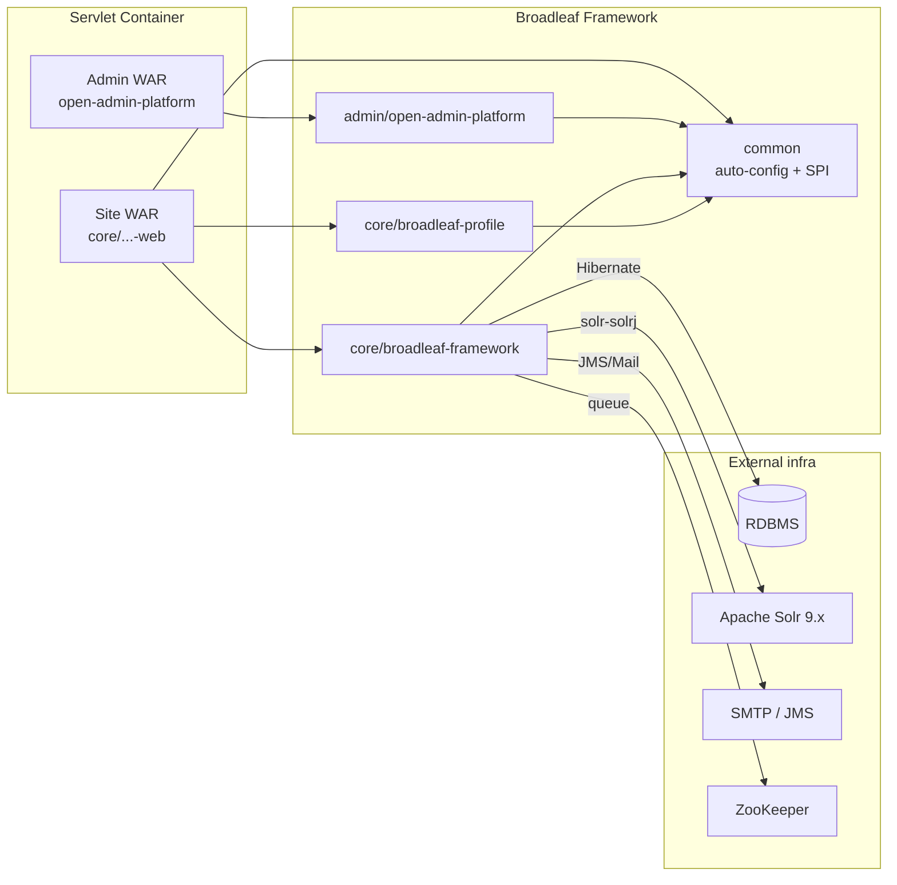

# ADR-001 — Current Architecture Baseline (BroadleafCommerce CE)

**Status:** Accepted (baseline snapshot)
**Date:** 2026-06-10
**Repo:** [johrenberger/BroadleafCommerce](https://github.com/johrenberger/BroadleafCommerce)
**Commit:** `bb97830278d5912941aea36a372d3d4e87406e6a`
**Workflow:** app-dev-discovery

## Context

This ADR captures the *as-is* architecture of Broadleaf Commerce Community
Edition (CE) as of commit `bb97830278d5912941aea36a372d3d4e87406e6a` so
that all future ADRs have a stable reference point. The full discovery
artefacts are in
`/tmp/broadleaf-ws/.openclaw/app-dev-discovery/`.

## Decision

BroadleafCommerce CE is a **traditional unified Java/Spring monolith** in
the form of a **multi-module Maven framework** (not a runnable
application). It exposes itself via Spring Boot auto-configuration
metadata. Implementers include the framework JARs as dependencies and
`@Import` the `EnableBroadleaf*AutoConfiguration` classes into their own
Spring context.

### Pinned facts

- **Language:** Java 17 (compiler source/target = 17).
- **Framework stack:** Spring 6.2.18 + Spring Security 6.5.10 +
  Spring Boot autoconfigure 3.5.14 + Hibernate 5.6.15.Final (Jakarta
  JPA) + Solr 9.9.0 (`solr-solrj` client) + Quartz 2.5.2 + SLF4J 2.0.17
  + Logback 1.5.32 + MVEL 2.5.2.Final + ehcache3 3.10.8 + spring-ldap
  3.3.6 + spring-security-oauth2-client 6.5.10.
- **Build:** Maven 3.x, 4 modules (`common`, `core/*`, `admin/*`,
  `integration`); root
  [`pom.xml`](https://github.com/johrenberger/BroadleafCommerce/blob/bb97830278d5912941aea36a372d3d4e87406e6a/pom.xml).
- **Deployment:** traditional servlet container (Tomcat / Jetty /
  Undertow). No first-party Docker / K8s / Terraform manifests in the
  source tree.
- **CI:** Jenkins via
  [`Jenkinsfile`](https://github.com/johrenberger/BroadleafCommerce/blob/bb97830278d5912941aea36a372d3d4e87406e6a/Jenkinsfile)
  (shared `maven-jdk17` pipeline). No `.github/workflows/*.yml` in
  this fork.
- **Database:** any JPA-compatible RDBMS; HSQLDB 2.7.4 for tests.
  **No Flyway / Liquibase.**
- **Domain model:** 155 JPA entities, top 5 by field count:
  `OrderItemImpl`, `CategoryImpl`, `FulfillmentGroupImpl`,
  `OfferImpl`, `AddressImpl`.
- **Admin:** "Open Admin" engine — `AdminBasicEntityController`
  (2,620 LoC) reflects over JPA metadata + `AdminPresentation`
  annotations to render any `@Entity` as a CRUD UI. ~70 of 103
  detected Spring MVC routes are admin endpoints.
- **Public API:** server-rendered Thymeleaf storefront +
  admin-engine Spring MVC. No first-party REST / GraphQL surface.
- **License:** Fair-Use dual-license
  ([`doc/license.txt`](https://github.com/johrenberger/BroadleafCommerce/blob/bb97830278d5912941aea36a372d3d4e87406e6a/doc/license.txt)).
  Not Apache 2.

### Architecture diagram (deployment view)

## Consequences

**Positive**

- **Single deployable** per environment (site + admin) keeps ops simple.
- **Spring autoconfig** lets implementers drop the framework in
  without writing glue.
- **Subclassable entities** (via `MergePersistenceUnitManager`) let
  implementers override behavior without forking the framework.
- **JPA-portable** to PostgreSQL / MySQL / Oracle / SQL Server.
- **All major e-commerce primitives** are present (catalog, cart,
  checkout, order, fulfillment, payment, search, CMS, admin).

**Negative / Trade-offs**

- 17 production files > 1,000 LoC, including
  `AdminBasicEntityController` (2,620), `FormBuilderServiceImpl`
  (2,191), `OrderServiceImpl` (1,277) — **maintainability risk**.
- 59 active TODO / FIXME comments, several explicitly
  "next-minor-release" — **reliability risk**.
- **No Flyway / Liquibase** — schema migration is the operator's
  problem.
- **No first-party observability** — no metrics, no tracing, no
  Sentry.
- **Old libraries on the classpath** — `cglib-nodep` 2.1_3 (2008),
  `asm` 3.3, `httpclient` 4.5.14 — **security/maintenance debt**.
- **No API reference docs** — public Spring MVC surface is documented
  only implicitly via the admin engine.
- **No `.env.example`, no Docker / docker-compose** — onboarding to a
  local sandbox is bespoke.
- **Fair-Use license** (not Apache 2) imposes a revenue cap on CE
  deployments.

## Evidence

- Final onboarding doc: `/tmp/broadleaf-ws/docs/2026-06-10-BroadleafCommerce-app-dev-discovery.md`
- Repo metadata: `/tmp/broadleaf-ws/.openclaw/app-dev-discovery/00-run-metadata.md`
- File inventory: `/tmp/broadleaf-ws/.openclaw/app-dev-discovery/01-file-inventory.md`
- Documentation review: `/tmp/broadleaf-ws/.openclaw/app-dev-discovery/02-documentation-evidence.md`
- Technology stack: `/tmp/broadleaf-ws/.openclaw/app-dev-discovery/03-stack-evidence.md`
- Structure: `/tmp/broadleaf-ws/.openclaw/app-dev-discovery/04-structure-evidence.md`
- Components: `/tmp/broadleaf-ws/.openclaw/app-dev-discovery/05-components-evidence.md`
- Flows: `/tmp/broadleaf-ws/.openclaw/app-dev-discovery/06-flows-evidence.md`
- Data model: `/tmp/broadleaf-ws/.openclaw/app-dev-discovery/07-data-evidence.md`
- Dependencies: `/tmp/broadleaf-ws/.openclaw/app-dev-discovery/08-dependencies-integrations-evidence.md`
- API: `/tmp/broadleaf-ws/.openclaw/app-dev-discovery/09-api-evidence.md`
- Testing: `/tmp/broadleaf-ws/.openclaw/app-dev-discovery/10-testing-evidence.md`
- Error/logging: `/tmp/broadleaf-ws/.openclaw/app-dev-discovery/11-error-logging-evidence.md`
- Security: `/tmp/broadleaf-ws/.openclaw/app-dev-discovery/12-security-evidence.md`
- Build/deploy: `/tmp/broadleaf-ws/.openclaw/app-dev-discovery/13-build-deploy-evidence.md`
- Risk & hygiene: `/tmp/broadleaf-ws/.openclaw/app-dev-discovery/14-risk-hygiene-evidence.md`
- Contradictions: `/tmp/broadleaf-ws/.openclaw/app-dev-discovery/15-contradiction-detection.md`

## Alternatives Considered

- **Broadleaf Commerce Microservices Edition** — separate commercial
  product, splits site / admin / search / cart into independent
  services. Higher operational cost; out of scope for CE baseline.
- **Apache OfBiz** — Apache 2, but has a much smaller ecosystem and
  no equivalent "open admin" engine for entity-driven CRUD.
- **Spring PetClinic / Vanilla Spring** — would require ~20× the
  effort to build catalog / cart / checkout / Solr integration.
