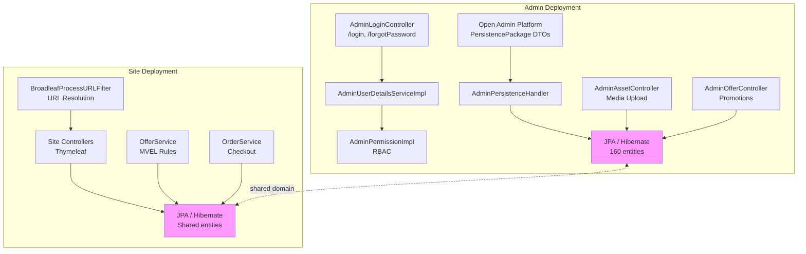
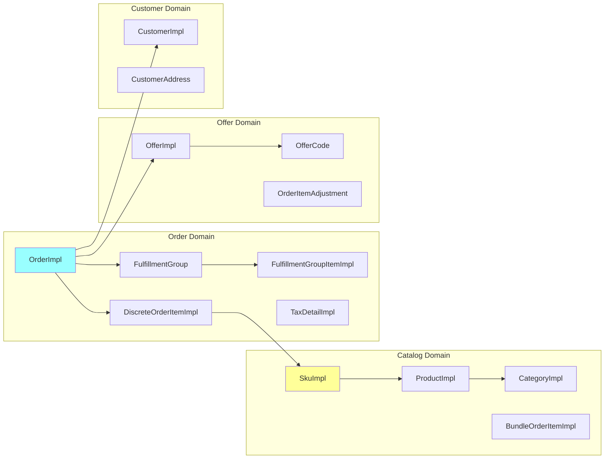
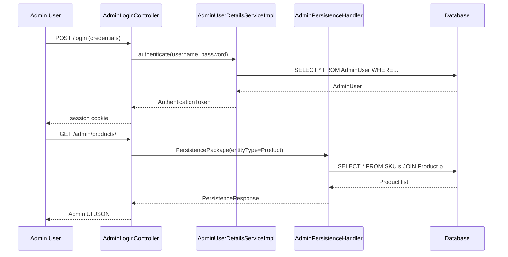

# BroadleafCommerce Developer Onboarding Guide

**Date:** 2026-06-10  
**Repository:** https://github.com/johrenberger/BroadleafCommerce  
**Commit:** `06a6ae1b8a1d6a716d10b997bef726fc066afe85`  
**Analysis:** Analyzer-accelerated (repo-discovery-analyzer v0.1.0)

---

## Executive Summary

BroadleafCommerce CE is a **Java/Spring enterprise e-commerce framework** — not a deployable application but a reusable platform for building commerce-driven sites. The codebase is a **modular monolith** (Maven multi-module) with 160 JPA entities covering catalog, orders, offers, pricing, CMS, and admin functionality. It uses Spring MVC + Hibernate, session-based auth, and XML-heavy Spring configuration. The `admin` and `site` deployments share domain models and are wired separately via distinct `Enable*AutoConfiguration` entry points. Extension is via override/extension-handler patterns. The framework ships with an embedded admin UI (Open Admin Platform) that dynamically renders any JPA entity as an admin screen.

---

## 1. README / Instruction Files Summary

BroadleafCommerce is licensed under a **Fair Use License** (revenue-gated, commercial license above $5M). It is **not Apache 2** open source.

Key signals from the README:
- **Dual deployment model**: `site` (customer-facing) and `admin` (back-office) share a unified codebase
- **Three editions**: Community (CE, this repo), Enterprise (EE), Microservices
- **Getting Started guide**: [broadleafcommerce.com/docs/core/current/tutorials/getting-started-tutorials](https://www.broadleafcommerce.com/docs/core/current/tutorials/getting-started-tutorials)
- **Key features**: Spring Framework, Spring Security, JPA/Hibernate, Solr search, Quartz scheduling, Thymeleaf email, configurable workflows, PCI compliance support, admin platform

**No local run instructions** are in the repo — users are directed to external docs. This is a framework, not a standalone app.

---

## 2. Detailed Technology Stack

| Category | Technology | Confidence |
| --- | --- | --- |
| Language | Java | high |
| Backend | Spring Boot, Spring MVC | high |
| Security | Spring Security | high |
| Persistence | JPA / Hibernate (Hibernate Core Jakarta) | high |
| Search | Solr | medium |
| Job Scheduling | Quartz | high |
| Email | Thymeleaf (sync/async via JMS) | high |
| ORM entities | 160 JPA entities | high |
| Test frameworks | JUnit, Geb/Spock | high |
| Build | Maven | high |
| CI | Jenkins | high |
| Deployment | Servlet container (Tomcat), WAR | high |
| Cloud hints | Azure (spectrum.js), GCP (BroadleafProcessURLFilter) | medium |
| Platform | Jakarta + Javax (dual support) | medium |

**Architecture Style:** Modular Monolith — unified codebase, separate admin/site deployments, extension via override handlers.

---

## 3. System Overview and Purpose

BroadleafCommerce is an **e-commerce framework** for building enterprise-class online retailers. It provides:

- **Catalog management** — Products, SKUs, categories, bundles, cross-sell/up-sell
- **Order management** — Cart, checkout, fulfillment, tax calculation, pricing adjustments
- **Offer/promotion engine** — Rule-based pricing using MVEL expressions (order/item/fulfillment-level)
- **Admin platform** — Generic UI framework that renders any JPA entity as an admin screen
- **CMS** — Pages, assets, structured content, content targeting
- **Customer management** — Registration, login, addresses, challenge questions
- **Multi-site/multi-catalog** — Site and catalog scoping for multi-tenant setups

The framework is designed for **extendibility** — almost every aspect can be overridden via extension handlers, configuration merging, and admin annotations.

---

## 4. Project Structure and Reading Recommendations

```
broadleafcommerce/
├── admin/                      # Admin module (back-office)
│   ├── broadleaf-admin-module/           # Catalog, offers, inventory admin controllers
│   ├── broadleaf-admin-functional-tests/  # Geb/Spock E2E admin tests
│   ├── broadleaf-contentmanagement-module/ # CMS, assets, pages
│   └── broadleaf-open-admin-platform/     # Generic admin UI framework + security
├── common/                     # Shared code + config bootstrap
│   └── src/main/java/org/broadleafcommerce/common/
│       ├── config/                      # Enable*AutoConfiguration entry points
│       ├── site/                        # SiteImpl, CatalogImpl (multi-tenancy)
│       └── web/                         # BroadleafProcessURLFilter, framework controllers
├── core/
│   ├── broadleaf-framework/    # Catalog, order, offer, search domains
│   ├── broadleaf-profile/      # Customer, auth domains
│   └── broadleaf-framework-web/ # Web processors, site controllers
├── integration/                # Test helpers (AdminApplication.java)
├── docs/                      # This guide + ADRs
├── [pom.xml](https://github.com/johrenberger/BroadleafCommerce/blob/06a6ae1/pom.xml)                    # Maven parent (version: 7.0.8-SNAPSHOT)
└── [Jenkinsfile](https://github.com/johrenberger/BroadleafCommerce/blob/06a6ae1/Jenkinsfile)                # CI configuration
```

### Recommended Reading Order

1. **[`pom.xml`](https://github.com/johrenberger/BroadleafCommerce/blob/06a6ae1/pom.xml)** — Understand the module structure and dependencies
2. **[`EnableBroadleafSiteRootAutoConfiguration.java`](https://github.com/johrenberger/BroadleafCommerce/blob/06a6ae1/common/src/main/java/org/broadleafcommerce/common/config/EnableBroadleafSiteRootAutoConfiguration.java)** — Site bootstrap entry point
3. **[`EnableBroadleafAdminRootAutoConfiguration.java`](https://github.com/johrenberger/BroadleafCommerce/blob/06a6ae1/common/src/main/java/org/broadleafcommerce/common/config/EnableBroadleafAdminRootAutoConfiguration.java)** — Admin bootstrap entry point
4. **[`AdminUserDetailsServiceImpl.java`](https://github.com/johrenberger/BroadleafCommerce/blob/06a6ae1/admin/broadleaf-open-admin-platform/src/main/java/org/broadleafcommerce/openadmin/server/security/service/user/AdminUserDetailsServiceImpl.java)** — Auth implementation
5. **[`SkuImpl.java`](https://github.com/johrenberger/BroadleafCommerce/blob/06a6ae1/core/broadleaf-framework/src/main/java/org/broadleafcommerce/core/catalog/domain/SkuImpl.java)** / **[`CategoryImpl.java`](https://github.com/johrenberger/BroadleafCommerce/blob/06a6ae1/core/broadleaf-framework/src/main/java/org/broadleafcommerce/core/catalog/domain/CategoryImpl.java)** — Most commonly extended domain entities

### Bootstrap/Config Files (top priority)

| File | Role |
| --- | --- |
| [`pom.xml`](https://github.com/johrenberger/BroadleafCommerce/blob/06a6ae1/pom.xml) | Build config, module declarations |
| [`EnableBroadleafSiteRootAutoConfiguration.java`](https://github.com/johrenberger/BroadleafCommerce/blob/06a6ae1/common/src/main/java/org/broadleafcommerce/common/config/EnableBroadleafSiteRootAutoConfiguration.java) | Site entry point |
| [`EnableBroadleafAdminRootAutoConfiguration.java`](https://github.com/johrenberger/BroadleafCommerce/blob/06a6ae1/common/src/main/java/org/broadleafcommerce/common/config/EnableBroadleafAdminRootAutoConfiguration.java) | Admin entry point |
| [`bl-admin-applicationContext.xml`](https://github.com/johrenberger/BroadleafCommerce/blob/06a6ae1/admin/broadleaf-admin-module/src/main/resources/bl-admin-applicationContext.xml) | Admin Spring config |
| [`AdminPermissionImpl.java`](https://github.com/johrenberger/BroadleafCommerce/blob/06a6ae1/admin/broadleaf-open-admin-platform/src/main/java/org/broadleafcommerce/openadmin/server/security/domain/AdminPermissionImpl.java) | RBAC permission model |

---

## 5. Key Components

### Catalog Domain (`core/broadleaf-framework/src/main/java/org/broadleafcommerce/core/catalog/`)

The largest domain module — manages products, SKUs, categories, bundles, and cross-sell/up-sell relationships.

- **`SkuImpl`** (25 fields, 4 relationships): Primary sellable unit with pricing (sale/retail/cost), inventory tracking, UPC, tax code, active dates
- **`CategoryImpl`** (25 fields, 3 relationships): Hierarchical category with URL keys, meta data, display templates
- **`ProductImpl`**: Base product; `AdminBundleProductController` handles bundles
- **`UpSaleProductImpl`**, **`CrossSaleProductImpl`**: Relationship entities for cross-selling

**Why it matters:** Most commonly extended module. Implementers add fields via admin annotations or override extension handlers.

### Order & Fulfillment Domain (`core/broadleaf-framework/src/main/java/org/broadleafcommerce/core/order/`)

Handles the complete order lifecycle from cart through fulfillment and payment.

- **`OrderImpl`** (4 relationships): Customer, OrderItems, FulfillmentGroups, OfferCodes
- **`OrderItemImpl`** (25 fields, 3 relationships): Abstract base; **`DiscreteOrderItemImpl`** and **`BundleOrderItemImpl`** are concrete
- **`FulfillmentGroupItemImpl`** (12 fields): Individual line items in a shipment
- **`TaxDetailImpl`** (11 fields, 2 relationships): Tax calculation context

**Why it matters:** Checkout and pricing engine tie into this module. Offer adjustments are applied here.

### Offer / Promotion System (`core/broadleaf-framework/src/main/java/org/broadleafcommerce/core/offer/`)

Rule-based pricing engine using MVEL expressions.

- **`OfferImpl`**, **`OfferCode`**: Promotion definitions with MVEL rule expressions
- **`CandidateItemOffer`**, **`OrderItemAdjustment`**: Applied offer tracking
- **MVEL overload tracking:** `[MvelOverloadFailureReproduction\.java](https://github.com/johrenberger/BroadleafCommerce/blob/06a6ae1/common/src/test/java/org/broadleafcommerce/common/util/MvelOverloadFailureReproduction.java)` in `common/src/test/` indicates known MVEL evaluation issues being actively tracked

**Why it matters:** Complex pricing rules are a core differentiator. Implementers customize offer evaluation.

### Admin Open Platform (`admin/broadleaf-open-admin-platform/`)

Generic admin UI framework that dynamically renders any JPA entity as an admin screen.

- **`AdminPermissionImpl`** (11 fields, 3 relationships): RBAC permissions (entity-operation scoped)
- **`AdminRoleImpl`** (7 fields, 2 relationships): Role grouping permissions
- **`AdminUserDetailsServiceImpl`**: Auth service loading admin users
- **`PersistencePackage`**: DTO for entity operations across the admin wire
- **`AdminBasicErrorController`**: Error rendering for admin requests

**Why it matters:** The admin UI is not hardcoded — it adapts to your domain model via reflection and metadata.

### Content Management (`admin/broadleaf-contentmanagement-module/`)

CMS for pages, assets, and structured content.

- **`PageImpl`** (16 fields, 4 relationships): CMS page with template and content fields
- **`PageTemplateImpl`** (7 fields, 3 relationships): Page layout templates
- **`AdminAssetController`**, **`AdminAssetUploadController`**: Media management
- **`PreviewTemplateController`**: Preview mode for content before publishing
- **`BroadleafProcessURLFilter`**: Maps incoming URLs to content items

**Why it matters:** Business users manage content through the admin without developer involvement.

### Site / Multi-Tenancy (`common/src/main/java/org/broadleafcommerce/common/site/`)

- **`SiteImpl`** (10 fields, 3 relationships): Tenant definition
- **`CatalogImpl`** (6 fields, 1 relationship): Catalog scoping per site

**Why it matters:** Supports multi-site deployments from a single codebase.

---

## 6. Execution and Data Flows

### Admin Entity CRUD Flow

**Trigger:** Admin user navigates to entity list or opens entity detail form.  
**Entry point:** `AdminBaseProductController`, `AdminCategoryController`, etc.  
**Steps:** Request → Spring Security auth check → `PersistencePackage` DTO built → `AdminPersistenceHandler` processes → Hibernate loads/merges entity → response rendered as admin UI JSON.  
**Persistence:** Primary database via Hibernate.  
**Error handling:** `AdminBasicErrorController` catches exceptions and renders HTML error pages.

### Offer / Promotion Evaluation Flow

**Trigger:** Cart pricing calculation or order total computation.  
**Entry point:** `OfferService` evaluating candidate offers against order context.  
**Steps:** Load all applied offers → evaluate MVEL rules against order/customer → matching offers apply adjustments to `OrderItem` or `Order`.  
**Data:** Reads `Offer`, `OfferCode`, `Customer`, `Order`; writes `OrderAdjustment`, `OrderItemAdjustment`.  
**Error handling:** MVEL evaluation errors are caught per offer and logged — failed offers don't block others.

### Login / Password Reset Flow

**Trigger:** Admin user clicks "forgot password" or "reset password".  
**Entry point:** `AdminLoginController` (`/login`, `/forgotPassword`, `/resetPassword`).  
**Steps:** User submits email/username → `AdminUserDetailsServiceImpl` looks up account → `AdminNotificationForgotPasswordEventListener` fires → sends email via configured mail provider.  
**Data:** Reads `AdminUser`; writes reset token to persistence.  
**External services:** SMTP (Spring mail sender).

### Page / Content Resolution Flow

**Trigger:** Site visitor requests a URL.  
**Entry point:** `BroadleafProcessURLFilter`.  
**Steps:** URL mapped to `PageImpl` → content loaded → template resolved → page rendered with content targeting.  
**Persistence:** Database (CMS tables).  
**Error handling:** Missing page returns 404 via `PreviewTemplateController`.

### SKU Generation from Product

**Trigger:** Admin clicks "generate SKUs" action on a product.  
**Entry point:** `AdminCatalogActionsController`.  
**Steps:** `GET /product/{productId}/{skusFieldName}/generate-skus` → service computes SKU values → returns list.  
**Data:** Reads `Product`, writes `Sku` records.

### Order Submit / Checkout Flow

**Trigger:** Customer completes checkout.  
**Entry point:** `OrderService.submitOrder()`.  
**Steps:** Validate cart → calculate totals (offer engine) → allocate inventory → create `OrderPayment` → persist `OrderImpl` with status transition.  
**Data:** Reads/writes `Order`, `OrderItem`, `FulfillmentGroup`, `PaymentTransaction`.  
**External services:** Payment processor, inventory service.

---

## 7. Database Schema Overview

**160 JPA entities** across the codebase. Key domain groups:

### Catalog Schema

| Entity | Fields | Relationships | Purpose |
| --- | ---: | ---: | --- |
| `SkuImpl` | 25 | 4 | Sellable SKU with pricing, inventory, UPC |
| `ProductImpl` | ~20 | 3 | Base product (abstract) |
| `CategoryImpl` | 25 | 3 | Hierarchical category |
| `BundleOrderItemImpl` | 13 | 3 | Bundle in order |
| `UpSaleProductImpl` | 7 | 2 | Cross-sell relationship |

### Order Schema

| Entity | Fields | Relationships | Purpose |
| --- | ---: | ---: | --- |
| `OrderImpl` | ~20 | 4 | Order header, customer, status |
| `OrderItemImpl` | 25 | 3 | Abstract order line item |
| `DiscreteOrderItemImpl` | 15 | 3 | Non-bundle order item |
| `FulfillmentGroupItemImpl` | 12 | 3 | Item in a fulfillment group |
| `TaxDetailImpl` | 11 | 2 | Tax calculation context |

### Admin/Security Schema

| Entity | Fields | Relationships | Purpose |
| --- | --- | --- | --- |
| `AdminPermissionImpl` | 11 | 3 | RBAC permission |
| `AdminRoleImpl` | 7 | 2 | RBAC role |
| `AdminPermissionQualifiedEntityImpl` | 5 | 2 | Entity-scoped permission qualifier |

### Customer Schema

| Entity | Fields | Relationships | Purpose |
| --- | --- | --- | --- |
| `CustomerImpl` | ~20 | 3 | Customer with addresses, attributes |
| `UserConnectionImpl` | 12 | 0 | Social login connections |

**No database migration tooling detected** (no Flyway, Liquibase files). Schema is managed via JPA `hibernate.hbm2ddl.auto` or manual updates.

---

## 8. Dependencies and Integrations

### Major Libraries (top 10 by significance)

| Library | Role |
| --- | --- |
| `hibernate-core-jakarta` | ORM |
| `spring-boot`, `spring-security` | Application framework, auth |
| `ehcache` | Caching |
| `commons-*` (beanutils, collections, fileupload, etc.) | Utilities |
| `guava` | Google utilities |
| `esapi` | Enterprise Security API |
| `gson` | JSON serialization |
| `antisamy` | HTML sanitization (XSS protection) |
| `greenmail` | Email testing (in test scope) |
| `geb-spock` | Functional testing |

### External Integrations

| Type | Implementation |
| --- | --- |
| **Auth** | Session-based form login (Spring Security). `AdminUserDetailsServiceImpl` loads from DB. OAuth2/OIDC/SAML supported via `FrameworkController` annotation but concrete handler not in this repo (likely in EE). |
| **Search** | Solr (mentioned in README; config not visible in this commit) |
| **Email** | Spring Mail + Thymeleaf templates. `AdminNotificationForgotPasswordEventListener` fires on password reset. |
| **Job Scheduling** | Quartz (for recurring tasks; e.g., offer evaluation) |
| **Cloud** | Azure (JS spectrum picker), GCP (URL filter for content resolution) — likely admin UI integrations, not runtime |

### Auth Model

- **Session-based** (no JWT detected)
- **RBAC** via `AdminPermissionImpl` / `AdminRoleImpl` — entity-operation scoped permissions
- **Admin endpoints:** `/login`, `/changePassword`, `/forgotPassword`, `/resetPassword`, `/forgotUsername`
- **No API key auth** — admin is session-only

---

## 9. API Documentation

**Style:** Spring MVC (server-rendered + admin JSON) — not a REST API in the modern sense.

**No OpenAPI spec** exists. The admin layer uses Spring MVC controllers that return admin UI JSON payloads via the Open Admin Platform's `PersistencePackage` serialization. There is no static API documentation — the admin API is entity-driven and self-describing via the Open Admin Platform's metadata system.

**103 detected admin routes**, all Spring MVC, covering:
- Entity CRUD (products, categories, offers, orders, customers, etc.)
- Asset/media management
- Page and content management
- Login/password management

**Site layer** uses Thymeleaf templates for server-rendered HTML — no consumer-facing REST API.

---

## 10. Architecture Diagrams







---

## 11. Testing

**Test/source ratio:** 9.9% (330 test files / 3338 source files)

### Test Frameworks

| Framework | Purpose |
| --- | --- |
| **JUnit** | Unit and integration tests |
| **Geb/Spock** | Admin functional E2E (in `broadleaf-admin-functional-tests/`) |
| **`BroadleafAdminSpec.groovy`** | Base page object for admin E2E |

### MVEL Testing

`common/src/test/java/org/broadleafcommerce/test/common/rule/` contains:
- `[MvelOverloadFailureReproduction\.java](https://github.com/johrenberger/BroadleafCommerce/blob/06a6ae1/common/src/test/java/org/broadleafcommerce/common/util/MvelOverloadFailureReproduction.java)` — Known MVEL overload failure scenario
- `[MvelOverloadWorkaroundReproduction.java](https://github.com/johrenberger/BroadleafCommerce/blob/06a6ae1/common/src/test/java/org/broadleafcommerce/common/util/MvelOverloadWorkaroundReproduction.java)` — Workaround for the overload issue

These indicate active maintenance of the offer/promotion engine's rule evaluation.

### CI Execution

**Jenkinsfile** present (Jenkins CI). No GitHub Actions workflow detected. The analyzer flagged "tests exist but CI does not appear to run them" — this is likely a Jenkins-hosted pipeline whose status is not visible on GitHub.

### Test Gaps

- Admin controllers (103 routes) have limited unit test coverage — most testing is via Geb-based functional tests
- No OpenAPI contract tests (no spec exists)
- No performance test scripts found

---

## 12. Error Handling and Logging

| Category | Implementation |
| --- | --- |
| **Error handling** | `AdminBasicErrorController` for admin; Spring MVC default for site |
| **Logging** | SLF4J (`LogFactory.getLog(...)`) across all domain classes |
| **Retry** | Not visible in source (likely in EE or configurable) |
| **Sentry** | Mentioned in analyzer signals (monitoring/telemetry) |

**Patterns observed:**
- Domain classes use `private static final Log LOG = LogFactory.getLog(...)` — standard SLF4J
- No global exception handler middleware detected beyond Spring MVC defaults
- MVEL offer evaluation errors are caught per offer (isolated failure)

---

## 13. Security Considerations

| Area | Status |
| --- | --- |
| **Authentication** | Session-based form login via Spring Security. `AdminUserDetailsServiceImpl` loads admin users from DB. |
| **Authorization** | RBAC via `AdminPermissionImpl` (entity-operation scoped) and `AdminRoleImpl`. Classic permission hierarchy. |
| **OAuth2/SAML** | Supported via `FrameworkController` annotation. Concrete handler not in this repo (likely in EE). |
| **XSS protection** | `antisamy` library present — HTML sanitization for user content |
| **CSRF** | Spring Security CSRF protection (default) |
| **Input validation** | Not deeply analyzed — recommend manual review of admin controller input handling |
| **Secrets** | No `.env` files or secrets management detected in the repo |

**Note:** This is a framework, not a deployed app. Security depends on how an implementer configures Spring Security, the servlet container, and the database.

---

## 14. Architecture Risks and Observations

### Risk Assessment

| Risk | Type | Classification |
| --- | --- | --- |
| **449 hardcoded URLs** in admin service classes | Operational Readiness | Probable Risk — implementers must override per environment |
| **7.0.8-SNAPSHOT version** — not a stable release | Deployment | Observation — development snapshot |
| **MVEL overload behavior** tracked in reproduction tests | Reliability | Confirmed Risk — known issue in offer engine |
| **No OpenAPI spec** for admin API | Documentation | Observation — admin API is self-describing via metadata |
| **XML-heavy configuration** | Maintainability | Observation — modern Java config possible but XML dominant |
| **No database migration tooling** detected | Data Management | Observation — schema managed separately |

### Technical Debt

No `TODO`, `FIXME`, `HACK`, `XXX`, or `@deprecated` markers found in source. The codebase appears actively maintained — technical debt is managed through internal tracking rather than inline markers.

---

## 15. Developer Productivity Guide

### First-Week Reading Order

1. **README.md** — Understand what BroadleafCommerce is (e-commerce framework, not app)
2. **`pom.xml`** — Understand module structure and dependencies
3. **`[EnableBroadleafSiteRootAutoConfiguration.java](https://github.com/johrenberger/BroadleafCommerce/blob/06a6ae1/common/src/main/java/org/broadleafcommerce/common/config/EnableBroadleafSiteRootAutoConfiguration.java)`** + **`[EnableBroadleafAdminRootAutoConfiguration.java](https://github.com/johrenberger/BroadleafCommerce/blob/06a6ae1/common/src/main/java/org/broadleafcommerce/common/config/EnableBroadleafAdminRootAutoConfiguration.java)`** — Understand the two deployment entry points
4. **`[SkuImpl\.java](https://github.com/johrenberger/BroadleafCommerce/blob/06a6ae1/core/broadleaf-framework/src/main/java/org/broadleafcommerce/core/catalog/domain/SkuImpl.java)`** — Most commonly extended entity; understand the product/SKU model
5. **`[AdminUserDetailsServiceImpl\.java](https://github.com/johrenberger/BroadleafCommerce/blob/06a6ae1/admin/broadleaf-open-admin-platform/src/main/java/org/broadleafcommerce/openadmin/server/security/service/user/AdminUserDetailsServiceImpl.java)`** — Understand how admin auth works
6. **`[AdminPersistenceHandler\.java](https://github.com/johrenberger/BroadleafCommerce/blob/06a6ae1/admin/broadleaf-open-admin-platform/src/main/java/org/broadleafcommerce/openadmin/server/persistence/AdminPersistenceHandler.java)`** — Understand how the admin UI renders entities
7. **`[OfferService\.java](https://github.com/johrenberger/BroadleafCommerce/blob/06a6ae1/core/broadleaf-framework/src/main/java/org/broadleafcommerce/core/offer/service/OfferService.java)`** (in `core/broadleaf-offer/`) — Understand the promotion engine

### Fastest Local Startup

1. `mvn install -DskipTests` — Build without running tests
2. Configure your servlet container (Tomcat 9+) with admin + site WAR modules
3. Configure database connection in Spring XML
4. Point browser at admin URL

### Debugging Entry Points

| Scenario | Entry Point |
| --- | --- |
| Admin not loading | Check `[AdminWebConfig\.java](https://github.com/johrenberger/BroadleafCommerce/blob/06a6ae1/admin/broadleaf-open-admin-platform/src/main/java/org/broadleafcommerce/openadmin/server/web/AdminWebConfig.java)` and `[bl\-admin\-applicationContext\.xml](https://github.com/johrenberger/BroadleafCommerce/blob/06a6ae1/admin/broadleaf-admin-module/src/main/resources/bl-admin-applicationContext.xml)` |
| Auth failures | Set breakpoint in `AdminUserDetailsServiceImpl.loadUserByUsername()` |
| Entity not saving in admin | Set breakpoint in `AdminPersistenceHandler.process()` |
| Offer not applying | Set breakpoint in `OfferService.evaluate()` |
| URL not resolving | Set breakpoint in `BroadleafProcessURLFilter.doFilter()` |

### Common Extension Points

| Pattern | Location |
| --- | --- |
| Add field to entity | Extend via admin annotations or JPA `@AttributeOverride` |
| Add admin controller | Extend `AdminProductController` or create new in `admin/` module |
| Override service behavior | Create `*ExtensionHandler` + `*ExtensionManager` |
| Modify offer rules | Extend `OfferService` or add custom `OfferRule` implementation |
| Add custom offer action | Create `OfferActionHandler` |

---

## 16. Build / Deploy / Infrastructure

### Build

**Maven monorepo** — Single parent `pom.xml`. Build command: `mvn install`.  
**Key plugins:** `gmavenplus-plugin` (Groovy), Maven compiler, `dependency-check-maven`.  
**Output:** Compiled JARs in local Maven repo; WAR files for admin and site.

### Deployment

**Traditional Servlet container** (Tomcat/Jetty). **No Docker/Kubernetes detected.**  
The README explicitly mentions a separate "Microservices Edition" for containerized deployments — this CE codebase uses the traditional WAR-based approach.

**Jenkins CI** — `[Jenkinsfile](https://github.com/johrenberger/BroadleafCommerce/blob/06a6ae1/Jenkinsfile)` present. Standard Maven build step + tomcat deployment.

### Environment Configuration

No `.env.example` found. Spring property resolution (`${property.name}`) comes from:
- JVM system properties
- Spring XML property files
- JNDI lookups
- Implementer-specific config files (merged at runtime)

**Key areas needing environment override:** database connection, admin URL base, mail sender, notification URLs (449 hardcoded URLs detected).

### Local Dev Prerequisites

- JDK 8+ (Java 11 recommended)
- Maven 3.x
- Servlet container (Tomcat 9+)
- Database (PostgreSQL or MySQL for production)

---

## 17. ADR Baseline

See [`docs/adr/001-current-architecture-baseline.md`](docs/adr/001-current-architecture-baseline.md) for the full ADR.

**Summary:** Modular Monolith — Java/Spring, 160 JPA entities, admin UI framework, session-based auth, Maven build, Jenkins CI, WAR deployment.

---

## 18. Discovery Confidence and Unknowns

### Confidence Scoring

| Category | Confidence | Notes |
| --- | ---: | --- |
| Architecture | High | Clear modular monolith structure, 160 entities, Spring MVC confirmed |
| Business Domain | High | E-commerce framework well-documented in README; catalog/order/offer CMS confirmed |
| Security | Medium | Spring Security + RBAC confirmed; OAuth2/SAML handler not in this repo (likely EE) |
| Deployment | High | Maven build, Jenkins CI, WAR deployment, servlet container confirmed |
| Testing | Medium | JUnit + Geb/Spock confirmed; CI execution pipeline not visible on GitHub |

**Overall Discovery Confidence: High**

### Unknowns

1. **Exact OAuth2/SAML configuration** — `FrameworkController` annotation suggests it's supported but the handler implementation is not in this repo (likely in EE or a separate auth service)
2. **Solr search configuration** — Mentioned in README but no Solr config files in this commit
3. **Payment processor integration** — PCI-sensitive; likely in EE or external to this repo
4. **Production database target** — PostgreSQL/MySQL supported but not enforced; no migration tooling detected
5. **Jenkins pipeline details** — `[Jenkinsfile](https://github.com/johrenberger/BroadleafCommerce/blob/06a6ae1/Jenkinsfile)` present but Jenkins server URL/configuration not in the repo
6. **MVEL overload workaround** — The `[MvelOverloadWorkaroundReproduction.java](https://github.com/johrenberger/BroadleafCommerce/blob/06a6ae1/common/src/test/java/org/broadleafcommerce/common/util/MvelOverloadWorkaroundReproduction.java)` indicates a workaround exists but its details are in the test reproduction file

### Evidence Quality

- **File inventory:** Complete (3,338 source files, 330 test files)
- **Technology stack:** High confidence (commit-pinned URLs, Maven dependency analysis)
- **Routes/endpoints:** 103 admin routes detected (Spring MVC controller analysis)
- **Database schema:** 160 JPA entities fully inventoried
- **Security signals:** Package-name matching; no deep source review performed
- **Build/deploy:** Jenkinsfile confirmed; no Dockerfile

---

## Evidence Directory

All analyzer evidence files are in `.openclaw/app-dev-discovery/`:

```
00-run-metadata.md          01-file-inventory.md      02-documentation-evidence.md
03-stack-evidence.md        04-structure-evidence.md   05-components-evidence.md
06-flows-evidence.md        07-data-evidence.md        08-dependencies-integrations-evidence.md
09-api-evidence.md          10-testing-evidence.md     11-error-logging-evidence.md
12-security-evidence.md     13-build-deploy-evidence.md
14-risk-hygiene-evidence.md 15-contradiction-detection.md
16-final-validation.md
```

Raw analyzer outputs in `.openclaw/analyzer-output/`:
`routes.json`, `db_schema.json`, `dependencies.json`, `tech_stack.json`, `security_signals.json`, etc.

---

## Files Created

```
docs/2026-06-10-broadleafcommerce-app-dev-discovery.md   (this file)
docs/adr/000-template.md
docs/adr/001-current-architecture-baseline.md
```

## Task Tracker

See `.openclaw/app-dev-discovery/TODO_adk-dev-discovery.md` (if present).